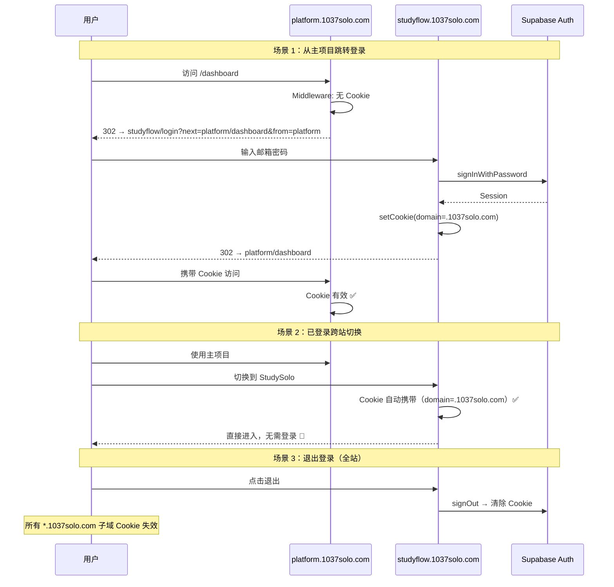

# 统一登录 SSO 跨项目认证 · 实施指南

> 📅 创建日期：2026-02-27  
> 📌 所属模块：user_auth · 用户认证与权限  
> 🔗 关联文档：[01-auth-and-guard-strategy](./01-auth-and-guard-strategy.md) · [05-email-verification](./05-email-verification-implementation.md) · [06-slider-captcha](./06-slider-captcha-implementation.md)  
> 🎯 定位：**1037Solo 全站统一登录（SSO）架构，基于同主域 Cookie 共享 + 共享 Supabase Auth 实现跨项目免登录**

---

## 📑 目录

- [一、SSO 架构总览](#一sso-架构总览)
- [二、同主域 Cookie 共享机制](#二同主域-cookie-共享机制)
- [三、Supabase Auth 共享配置](#三supabase-auth-共享配置)
- [四、跨项目跳转登录流程](#四跨项目跳转登录流程)
- [五、路由守卫实现](#五路由守卫实现)
- [六、跨域退出同步](#六跨域退出同步)
- [七、认证页面与 API 设计](#七认证页面与-api-设计)
- [八、数据隔离与安全](#八数据隔离与安全)
- [九、ACTION ITEMS](#九action-items)

---

## 一、SSO 架构总览

### 1.1 域名拓扑

```
                    .1037solo.com          ← Cookie 共享域
                    ┌──────┴──────┐
        studyflow.1037solo.com    platform.1037solo.com
              │                         │
         StudySolo                 主项目 1037Solo
         (Next.js 16 + FastAPI)    (技术栈 TBD)
              │                         │
              └────── 共享 Supabase ──────┘
                   (同一个 Project)
```

### 1.2 核心设计理念

| 原则 | 说明 |
|------|------|
| **StudySolo = SSO 认证中心** | 所有子项目的登录/注册/找回密码都跳转到 `studyflow.1037solo.com` |
| **Cookie 做会话载体** | JWT Token 存入 `domain=.1037solo.com` 的 HttpOnly Cookie |
| **JWT 做身份载体** | uid, email, tier 嵌入 JWT Claim，无需查库 |
| **Supabase Auth 做鉴权引擎** | 不自建鉴权，复用 Supabase 的 session 管理 + RLS |

### 1.3 反模式（不做的事）

| ❌ 反模式 | 为什么不做 |
|-----------|------------|
| Cookie 存入 Supabase DB | JWT 无状态，不需要服务端存储 session |
| 自建 OAuth2 Server | 个人项目过度设计 |
| localStorage 存 Token | XSS 可直接窃取 |
| 每次请求查库验证 | JWT 自带签名验证 |

---

## 二、同主域 Cookie 共享机制

### 2.1 Cookie 属性配置

| 属性 | 值 | 解释 |
|------|-----|------|
| `Domain` | `.1037solo.com` | 以 `.` 开头，所有子域名自动共享 |
| `Path` | `/` | 所有路径可读取 |
| `HttpOnly` | `true` | JS 无法读取（防 XSS） |
| `Secure` | `true` | 仅 HTTPS 传输 |
| `SameSite` | `Lax` | 允许顶级导航携带 Cookie，阻止第三方 POST |

### 2.2 为什么是 `SameSite=Lax`

- **`Strict`**：跨子域跳转时不携带 Cookie → 已登录用户"丢失"登录态 ❌
- **`Lax`**：顶级导航携带 Cookie → 无缝切换 ✅
- **`None`**：所有请求携带 → CSRF 风险增加 ⚠️

### 2.3 Cookie 生命周期

```
登录成功 → access_token Cookie（1h 过期）+ refresh_token Cookie（30d 过期）
    │
    ├── 用户活跃：@supabase/ssr 自动刷新 access_token（无感知）
    └── 30 天不活跃 → refresh_token 过期 → 需重新登录
```

---

## 三、Supabase Auth 共享配置

### 3.1 两个项目使用同一 Supabase Project

```env
# 两个项目的 .env 值完全相同
NEXT_PUBLIC_SUPABASE_URL=https://xxxxx.supabase.co
NEXT_PUBLIC_SUPABASE_ANON_KEY=eyJhbGciOi...
```

### 3.2 Browser Client（关键配置）

```typescript
// src/utils/supabase/client.ts
import { createBrowserClient } from '@supabase/ssr'

export const createClient = () => {
  return createBrowserClient(
    process.env.NEXT_PUBLIC_SUPABASE_URL!,
    process.env.NEXT_PUBLIC_SUPABASE_ANON_KEY!,
    {
      cookieOptions: {
        domain: '.1037solo.com',   // ← 核心：跨子域共享
        path: '/',
        sameSite: 'lax',
        secure: true,
      }
    }
  )
}
```

### 3.3 Server Client

```typescript
// src/utils/supabase/server.ts
import { createServerClient } from '@supabase/ssr'
import { cookies } from 'next/headers'

export const createServerSupabase = async () => {
  const cookieStore = await cookies()
  return createServerClient(
    process.env.NEXT_PUBLIC_SUPABASE_URL!,
    process.env.NEXT_PUBLIC_SUPABASE_ANON_KEY!,
    {
      cookies: {
        getAll() { return cookieStore.getAll() },
        setAll(cookiesToSet) {
          cookiesToSet.forEach(({ name, value, options }) =>
            cookieStore.set(name, value, {
              ...options,
              domain: '.1037solo.com',
            })
          )
        },
      },
    }
  )
}
```

### 3.4 Middleware Session 自动刷新

```typescript
// src/utils/supabase/middleware.ts
import { createServerClient } from '@supabase/ssr'
import { NextRequest, NextResponse } from 'next/server'

export async function updateSession(request: NextRequest) {
  let supabaseResponse = NextResponse.next({ request })
  const supabase = createServerClient(
    process.env.NEXT_PUBLIC_SUPABASE_URL!,
    process.env.NEXT_PUBLIC_SUPABASE_ANON_KEY!,
    {
      cookies: {
        getAll() { return request.cookies.getAll() },
        setAll(cookiesToSet) {
          cookiesToSet.forEach(({ name, value }) => request.cookies.set(name, value))
          supabaseResponse = NextResponse.next({ request })
          cookiesToSet.forEach(({ name, value, options }) =>
            supabaseResponse.cookies.set(name, value, {
              ...options,
              domain: '.1037solo.com',
            })
          )
        },
      },
    }
  )
  const { data: { user } } = await supabase.auth.getUser()
  return { supabaseResponse, user }
}
```

### 3.5 主项目集成（仅需两步）

**① 初始化 Client（与 StudySolo 相同配置）**

**② 路由守卫：未登录 → 跳转 StudySolo 登录页**

```typescript
// platform: middleware 伪代码
if (!session) {
  const loginUrl = new URL('https://studyflow.1037solo.com/login')
  loginUrl.searchParams.set('next', request.url)
  loginUrl.searchParams.set('from', 'platform')
  redirect(loginUrl.toString())
}
```

---

## 四、跨项目跳转登录流程

### 4.1 URL 参数设计

| 参数 | 用途 | 示例 |
|------|------|------|
| `next` | 登录后跳回的 URL | `https://platform.1037solo.com/dashboard` |
| `from` | 来源标识 | `platform` / `studyflow` |

### 4.2 `next` URL 安全白名单

```typescript
// src/lib/auth/redirect.ts
const TRUSTED_DOMAINS = [
  'studyflow.1037solo.com',
  'platform.1037solo.com',
  'docs.1037solo.com',
]

export function isValidRedirectUrl(url: string): boolean {
  try {
    const parsed = new URL(url)
    return parsed.protocol === 'https:' &&
      TRUSTED_DOMAINS.some(d => parsed.hostname === d || parsed.hostname.endsWith(`.${d}`))
  } catch { return false }
}

export function getSafeRedirectUrl(next: string | null, fallback = '/'): string {
  return (next && isValidRedirectUrl(next)) ? next : fallback
}
```

### 4.3 完整时序图



---

## 五、路由守卫实现

### 5.1 StudySolo Middleware

```typescript
// src/middleware.ts
const PROTECTED_ROUTES = ['/workspace', '/settings', '/history', '/profile']
const AUTH_ROUTES = ['/login', '/register', '/forgot-password']

export async function middleware(request: NextRequest) {
  const { pathname } = request.nextUrl
  const { supabaseResponse, user } = await updateSession(request)

  // 保护路由：未登录 → 跳转登录
  const isProtected = PROTECTED_ROUTES.some(r => pathname.startsWith(r))
  if (isProtected && !user) {
    const loginUrl = new URL('/login', request.url)
    loginUrl.searchParams.set('next', pathname)
    return NextResponse.redirect(loginUrl)
  }

  // 认证路由：已登录 → 跳转应用
  const isAuthRoute = AUTH_ROUTES.some(r => pathname.startsWith(r))
  if (isAuthRoute && user) {
    const next = request.nextUrl.searchParams.get('next')
    const redirectTo = getSafeRedirectUrl(next, '/workspace')
    return NextResponse.redirect(
      redirectTo.startsWith('http') ? new URL(redirectTo) : new URL(redirectTo, request.url)
    )
  }

  return supabaseResponse
}
```

---

## 六、跨域退出同步

### 6.1 退出函数

```typescript
export async function signOut() {
  const supabase = createClient()
  await supabase.auth.signOut()  // 清除 Cookie (domain=.1037solo.com)

  // 广播退出事件（同源跨 Tab 同步）
  const channel = new BroadcastChannel('auth_channel')
  channel.postMessage({ type: 'logout' })
  channel.close()

  localStorage.setItem('auth_event', JSON.stringify({ type: 'logout', ts: Date.now() }))
  window.location.href = '/login'
}
```

### 6.2 跨子域退出机制

> `BroadcastChannel` 仅同源有效。不同子域的退出依赖 Cookie 删除：

```
用户在 studyflow 退出 → Cookie(domain=.1037solo.com) 被删除
    ├── studyflow 其他 Tab → BroadcastChannel 同步退出 ✅
    └── platform Tab → 下次请求 → JWT 验证失败 → 401 → 重定向登录页 ✅
```

---

## 七、认证页面与 API 设计

### 7.1 页面路由

```
app/(auth)/login/page.tsx           # 统一登录页
app/(auth)/register/page.tsx        # 注册页（滑动拼图 + 验证码）
app/(auth)/forgot-password/page.tsx # 忘记密码（滑动拼图 + 验证码）
```

### 7.2 后端 API 端点

| 方法 | 端点 | 说明 | 鉴权 |
|------|------|------|:----:|
| `POST` | `/api/auth/login` | 邮箱密码登录 | 否 |
| `POST` | `/api/auth/register` | 注册（含验证码） | 否 |
| `POST` | `/api/auth/send-code` | 发送验证码 | 否 |
| `POST` | `/api/auth/reset-password` | 重置密码 | 否 |
| `POST` | `/api/auth/logout` | 退出 | 是 |
| `GET` | `/api/auth/me` | 当前用户信息 | 是 |

---

## 八、数据隔离与安全

### 8.1 RLS 数据隔离

```sql
-- StudySolo 专用表
CREATE POLICY "users_own_workflows" ON workflows
    FOR ALL USING (auth.uid() = user_id);

-- Platform 专用表
CREATE POLICY "users_own_projects" ON platform_projects
    FOR ALL USING (auth.uid() = user_id);
```

### 8.2 JWT Tier Claim（Custom Hook）

```sql
CREATE OR REPLACE FUNCTION custom_access_token_hook(event jsonb)
RETURNS jsonb LANGUAGE plpgsql AS $$
DECLARE claims jsonb; user_tier text;
BEGIN
  claims := event->'claims';
  SELECT COALESCE(raw_user_meta_data->>'tier', 'free')
  INTO user_tier FROM auth.users WHERE id = (event->>'user_id')::uuid;
  claims := jsonb_set(claims, '{user_tier}', to_jsonb(user_tier));
  event := jsonb_set(event, '{claims}', claims);
  RETURN event;
END; $$;
```

### 8.3 安全 Checklist

- [x] Cookie HttpOnly + Secure + SameSite=Lax
- [x] `next` URL 白名单校验（防 Open Redirect）
- [x] CORS 限制 `*.1037solo.com`
- [x] RLS 数据隔离
- [x] JWT Claim 最小化（uid, email, tier）
- [x] Refresh Token 自动轮换

---

## 九、ACTION ITEMS

| 优先级 | 任务 | 涉及文件 | 预估 |
|:---|:---|:---|:---:|
| **P0** | Supabase Client 配置（cookieDomain） | `src/utils/supabase/*.ts` | 2h |
| **P0** | Next.js Middleware 路由守卫 | `src/middleware.ts` | 2h |
| **P0** | 登录/注册/找回密码页面 | `app/(auth)/*.tsx` | 6h |
| **P0** | 后端认证 API | `backend/app/api/auth.py` | 4h |
| **P1** | `next` URL 白名单校验 | `src/lib/auth/redirect.ts` | 1h |
| **P1** | 跨 Tab 退出同步 | `src/hooks/use-auth-sync.ts` | 2h |
| **P1** | JWT Custom Hook | Supabase SQL Editor | 1h |
| **P2** | 主项目集成文档 | `docs/integration-guide.md` | 2h |
| **P2** | CORS 配置 | `backend/app/main.py` | 0.5h |

**总预估**：~20.5h（约 3 工作日，与 MVP Phase 1 吻合）

---

> **一句话总结**：基于 `@supabase/ssr` 的 `cookieDomain=.1037solo.com`，实现 studyflow 和 platform 两个子域的无感 SSO。StudySolo 作为统一认证中心，所有子项目未登录时 302 跳转到 `studyflow.1037solo.com/login?next=原地址`，登录成功后自动跳回。不需要自建 OAuth Server，不需要在数据库存 Cookie。
