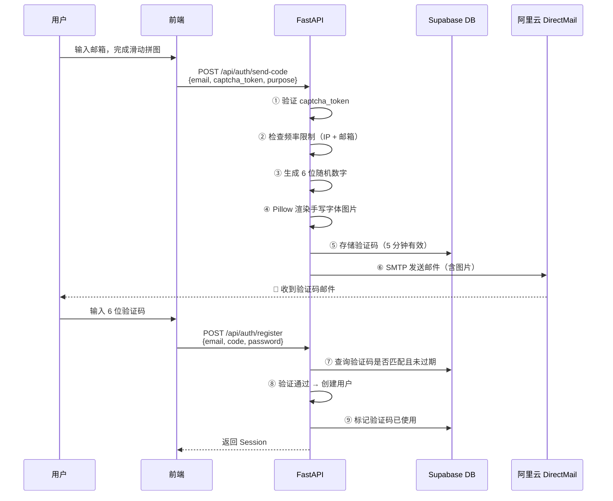

# 邮件验证码实现 · 实施指南

> 📅 创建日期：2026-02-27  
> 📌 所属模块：user_auth · 用户认证与权限  
> 🔗 关联文档：[04-sso-cross-project-auth](./04-sso-cross-project-auth.md) · [06-slider-captcha](./06-slider-captcha-implementation.md)  
> 🎯 定位：**阿里云 DirectMail SMTP 邮件发送 + 6 位手写字体验证码图片渲染 + 防刷策略**

---

## 📑 目录

- [一、验证码全链路流程](#一验证码全链路流程)
- [二、阿里云 DirectMail SMTP 配置](#二阿里云-directmail-smtp-配置)
- [三、6 位验证码生成与存储](#三6-位验证码生成与存储)
- [四、手写字体图片渲染](#四手写字体图片渲染)
- [五、邮件 HTML 模板](#五邮件-html-模板)
- [六、防刷策略（五层防线）](#六防刷策略五层防线)
- [七、后端 API 实现](#七后端-api-实现)
- [八、ACTION ITEMS](#八action-items)

---

## 一、验证码全链路流程

### 1.1 触发场景

| 场景 | 触发时机 | 验证码用途 |
|------|---------|------------|
| **注册** | 填写邮箱后点击"发送验证码" | 验证邮箱归属权 |
| **找回密码** | 填写邮箱后点击"发送验证码" | 验证身份后重置密码 |
| ~~登录~~ | ❌ 不做 | 邮箱 + 密码即可，无需验证码 |

### 1.2 完整时序



---

## 二、阿里云 DirectMail SMTP 配置

### 2.1 已有配置

```env
# backend/.env（已配置）
SMTP_HOST=smtpdm.aliyun.com
SMTP_PORT=465
SMTP_USER=accounts@email.1037solo.com
SMTP_PASS=SMTP985HUSTsmtpHAha
```

### 2.2 Python SMTP 封装

```python
# backend/app/services/email_service.py

import smtplib
from email.mime.multipart import MIMEMultipart
from email.mime.text import MIMEText
from email.mime.image import MIMEImage
from app.core.config import settings

class EmailService:
    """阿里云 DirectMail SMTP 邮件发送服务"""

    def __init__(self):
        self.host = settings.SMTP_HOST
        self.port = settings.SMTP_PORT
        self.user = settings.SMTP_USER
        self.password = settings.SMTP_PASS

    async def send_verification_email(
        self,
        to_email: str,
        code: str,
        code_image: bytes,
        purpose: str = "register"
    ):
        """发送包含手写字体验证码图片的邮件"""

        msg = MIMEMultipart("related")
        msg["From"] = f"StudySolo <{self.user}>"
        msg["To"] = to_email
        msg["Subject"] = self._get_subject(purpose)

        # HTML 正文
        html_body = self._build_html(purpose, code)
        msg.attach(MIMEText(html_body, "html", "utf-8"))

        # 内联验证码图片（CID 方式）
        img = MIMEImage(code_image, _subtype="png")
        img.add_header("Content-ID", "<verification_code>")
        img.add_header("Content-Disposition", "inline", filename="code.png")
        msg.attach(img)

        # 发送
        with smtplib.SMTP_SSL(self.host, self.port) as server:
            server.login(self.user, self.password)
            server.sendmail(self.user, to_email, msg.as_string())

    def _get_subject(self, purpose: str) -> str:
        subjects = {
            "register": "【StudySolo】注册验证码",
            "reset": "【StudySolo】密码重置验证码",
        }
        return subjects.get(purpose, "【StudySolo】验证码")

    def _build_html(self, purpose: str, code: str) -> str:
        """构建邮件 HTML 模板"""
        # 见第五节详细模板
        ...
```

### 2.3 发送限制（阿里云 DirectMail）

| 限制项 | 值 |
|--------|-----|
| 单日发送上限 | 2000 封（免费版），可申请提额 |
| 单次发送间隔 | 无限制（但我们自己做频率控制） |
| 发件人域名 | `email.1037solo.com`（需 SPF/DKIM 配置） |

---

## 三、6 位验证码生成与存储

### 3.1 验证码生成

```python
# backend/app/services/code_generator.py
import secrets

def generate_verification_code(length: int = 6) -> str:
    """生成纯数字验证码，使用密码学安全随机数"""
    return ''.join(str(secrets.randbelow(10)) for _ in range(length))
```

> ⚠️ 使用 `secrets.randbelow()` 而非 `random.randint()`，前者是密码学安全的。

### 3.2 数据库存储

```sql
-- Supabase: verification_codes 表
CREATE TABLE verification_codes (
    id UUID PRIMARY KEY DEFAULT gen_random_uuid(),
    email TEXT NOT NULL,
    code TEXT NOT NULL,
    purpose TEXT NOT NULL CHECK (purpose IN ('register', 'reset')),
    
    -- 安全字段
    attempts INTEGER DEFAULT 0,          -- 已尝试次数
    max_attempts INTEGER DEFAULT 5,      -- 最大尝试次数
    is_used BOOLEAN DEFAULT false,       -- 是否已使用
    
    -- 时间字段
    created_at TIMESTAMPTZ DEFAULT now(),
    expires_at TIMESTAMPTZ NOT NULL,     -- 过期时间（created_at + 5min）
    
    -- 来源追踪
    ip_address INET,
    user_agent TEXT
);

-- 索引
CREATE INDEX idx_codes_email_purpose ON verification_codes(email, purpose, created_at DESC);

-- 自动清理过期验证码（每小时运行一次）
-- 可通过 Supabase Edge Function 或 pg_cron 实现
```

### 3.3 验证码校验逻辑

```python
# backend/app/services/code_verifier.py

async def verify_email_code(email: str, code: str, purpose: str) -> bool:
    """校验验证码"""
    
    # 1. 查询最新一条未使用的验证码
    result = await supabase.table("verification_codes") \
        .select("*") \
        .eq("email", email) \
        .eq("purpose", purpose) \
        .eq("is_used", False) \
        .gt("expires_at", datetime.now(timezone.utc).isoformat()) \
        .order("created_at", desc=True) \
        .limit(1) \
        .execute()
    
    if not result.data:
        return False
    
    record = result.data[0]
    
    # 2. 检查尝试次数
    if record["attempts"] >= record["max_attempts"]:
        return False  # 已超过最大尝试次数
    
    # 3. 递增尝试次数
    await supabase.table("verification_codes") \
        .update({"attempts": record["attempts"] + 1}) \
        .eq("id", record["id"]) \
        .execute()
    
    # 4. 比对验证码（时间安全比对，防时序攻击）
    import hmac
    return hmac.compare_digest(record["code"], code)

async def invalidate_code(email: str, purpose: str):
    """标记验证码已使用"""
    await supabase.table("verification_codes") \
        .update({"is_used": True}) \
        .eq("email", email) \
        .eq("purpose", purpose) \
        .eq("is_used", False) \
        .execute()
```

---

## 四、手写字体图片渲染

### 4.1 为什么用图片而不是 Web Font

| 方案 | 邮件兼容性 | 推荐度 |
|------|:----------:|:------:|
| **后端 Pillow 渲染为图片** | 100% 所有客户端 | ⭐⭐⭐⭐⭐ |
| Web Font @import | ~50% Gmail/Outlook 不支持 | ⭐⭐ |
| SVG 内联 | ~70% 部分客户端阻止 | ⭐⭐⭐ |

### 4.2 推荐手写字体

| 字体 | 风格 | 来源 | 文件 |
|------|------|------|------|
| **Caveat** | 自然手写体（推荐） | Google Fonts | `Caveat-Bold.ttf` |
| Dancing Script | 流畅草书 | Google Fonts | `DancingScript-Bold.ttf` |
| ZCOOL KuaiLe | 可爱圆润 | Google Fonts | `ZCOOLKuaiLe-Regular.ttf` |

> 字体文件下载后放入 `backend/assets/fonts/` 目录。

### 4.3 Pillow 渲染实现

```python
# backend/app/services/code_renderer.py

from PIL import Image, ImageDraw, ImageFont
import io
import random
import math

class CodeRenderer:
    """手写字体验证码图片渲染器"""

    FONT_PATH = "assets/fonts/Caveat-Bold.ttf"
    
    # 尺寸配置
    WIDTH = 280
    HEIGHT = 80
    FONT_SIZE = 48
    
    # 颜色方案（深色文字 + 浅色背景）
    BG_COLOR = (250, 248, 245)        # 温暖米白
    TEXT_COLORS = [
        (51, 51, 51),                  # 墨黑
        (44, 62, 80),                  # 深灰蓝
        (39, 55, 70),                  # 深青
    ]
    
    def render(self, code: str) -> bytes:
        """将 6 位验证码渲染为手写字体风格的 PNG 图片"""
        
        img = Image.new("RGB", (self.WIDTH, self.HEIGHT), self.BG_COLOR)
        draw = ImageDraw.Draw(img)
        font = ImageFont.truetype(self.FONT_PATH, self.FONT_SIZE)
        
        # 计算起始位置（居中）
        total_width = len(code) * 38  # 每个字符大约 38px 宽
        start_x = (self.WIDTH - total_width) // 2
        
        # 逐字符绘制（每个字符独立旋转 + 偏移，增加手写感）
        for i, char in enumerate(code):
            x = start_x + i * 38 + random.randint(-3, 3)
            y = (self.HEIGHT - self.FONT_SIZE) // 2 + random.randint(-5, 5)
            
            color = random.choice(self.TEXT_COLORS)
            
            # 创建单字符图层（用于旋转）
            char_img = Image.new("RGBA", (50, 65), (0, 0, 0, 0))
            char_draw = ImageDraw.Draw(char_img)
            char_draw.text((5, 5), char, font=font, fill=color)
            
            # 轻微旋转（-8° ~ 8°）
            angle = random.uniform(-8, 8)
            char_img = char_img.rotate(angle, expand=True, resample=Image.BICUBIC)
            
            # 粘贴到主图
            img.paste(char_img, (x, y), char_img)
        
        # 添加轻微噪点线条（增加辨识度，但不影响可读性）
        self._add_decoration(draw)
        
        # 导出 PNG
        buffer = io.BytesIO()
        img.save(buffer, format="PNG", optimize=True)
        return buffer.getvalue()
    
    def _add_decoration(self, draw: ImageDraw.Draw):
        """添加装饰性元素（下划线 + 少量点）"""
        # 底部手写下划线
        y = self.HEIGHT - 15
        points = [(40, y)]
        for x in range(40, self.WIDTH - 40, 5):
            points.append((x, y + random.randint(-2, 2)))
        draw.line(points, fill=(200, 195, 190), width=2)
        
        # 少量装饰点
        for _ in range(8):
            x = random.randint(10, self.WIDTH - 10)
            y = random.randint(5, self.HEIGHT - 5)
            r = random.randint(1, 2)
            draw.ellipse([x-r, y-r, x+r, y+r], fill=(220, 215, 210))
```

### 4.4 依赖安装

```bash
pip install Pillow
```

---

## 五、邮件 HTML 模板

### 5.1 模板实现

```python
def _build_html(self, purpose: str, code: str) -> str:
    purpose_text = {
        "register": "注册",
        "reset": "重置密码",
    }
    action = purpose_text.get(purpose, "验证")
    
    return f"""
    <!DOCTYPE html>
    <html>
    <head><meta charset="UTF-8"></head>
    <body style="margin:0; padding:0; background-color:#f8f9fa; font-family: -apple-system, 'Segoe UI', sans-serif;">
      <table width="100%" cellpadding="0" cellspacing="0" style="max-width:560px; margin:40px auto;">
        <tr>
          <td style="background:#ffffff; border-radius:16px; padding:48px 40px; box-shadow:0 2px 8px rgba(0,0,0,0.06);">
            
            <!-- Logo -->
            <div style="text-align:center; margin-bottom:32px;">
              <span style="font-size:24px; font-weight:700; color:#1a1a2e;">
                🎓 StudySolo
              </span>
              <br>
              <span style="font-size:13px; color:#888; letter-spacing:1px;">
                1037Solo 统一账户
              </span>
            </div>
            
            <!-- 正文 -->
            <p style="font-size:16px; color:#333; line-height:1.6; margin-bottom:8px;">
              你好！
            </p>
            <p style="font-size:16px; color:#333; line-height:1.6; margin-bottom:24px;">
              你正在进行 <strong>{action}</strong> 操作，请使用以下验证码：
            </p>
            
            <!-- 验证码图片 -->
            <div style="text-align:center; margin:32px 0;">
              <div style="display:inline-block; background:#faf8f5; border:2px dashed #e0dcd8; border-radius:12px; padding:16px 32px;">
                
              </div>
            </div>
            
            <!-- 有效期 -->
            <p style="font-size:14px; color:#666; text-align:center; margin-bottom:32px;">
              ⏰ 验证码 <strong>5 分钟</strong>内有效
            </p>
            
            <!-- 安全提示 -->
            <div style="background:#fff8e1; border-radius:8px; padding:16px; margin-bottom:24px;">
              <p style="font-size:13px; color:#856404; margin:0;">
                ⚠️ 如果这不是你本人的操作，请忽略此邮件。请勿将验证码告知他人。
              </p>
            </div>
            
            <!-- 页脚 -->
            <hr style="border:none; border-top:1px solid #eee; margin:24px 0;" />
            <p style="font-size:12px; color:#999; text-align:center; margin:0;">
              © 1037Solo Team · 
              <a href="https://1037solo.com" style="color:#999;">1037solo.com</a>
              <br>黑ICP备2025046407号-3
            </p>
            
          </td>
        </tr>
      </table>
    </body>
    </html>
    """
```

### 5.2 邮件预览效果

```
┌─────────────────────────────────────────┐
│        🎓 StudySolo                      │
│        1037Solo 统一账户                  │
│                                          │
│  你好！                                   │
│  你正在进行 注册 操作，请使用以下验证码：    │
│                                          │
│  ┌╌╌╌╌╌╌╌╌╌╌╌╌╌╌╌╌╌╌╌╌╌╌╌╌╌╌╌╌┐         │
│  ╎                              ╎         │
│  ╎   🖊️  5 9 3 7 2 1           ╎  ← 手写字体图片
│  ╎      (Caveat Bold 渲染)      ╎         │
│  ╎                              ╎         │
│  └╌╌╌╌╌╌╌╌╌╌╌╌╌╌╌╌╌╌╌╌╌╌╌╌╌╌╌╌┘         │
│                                          │
│  ⏰ 验证码 5 分钟内有效                    │
│                                          │
│  ┌──────────────────────────────┐        │
│  │ ⚠️ 如果这不是你本人的操作，   │        │
│  │ 请忽略此邮件。               │        │
│  └──────────────────────────────┘        │
│                                          │
│  ─────────────────────────────────────   │
│  © 1037Solo Team · 1037solo.com          │
│  黑ICP备2025046407号-3                    │
└─────────────────────────────────────────┘
```

---

## 六、防刷策略（五层防线）

### 6.1 防线矩阵

| 层级 | 防线 | 实现位置 | 规则 |
|:----:|------|----------|------|
| 1 | **滑动拼图验证** | 前端 + 后端 | 必须完成拼图才能触发发送 |
| 2 | **IP 频率限制** | FastAPI slowapi | 同一 IP 每分钟最多 3 次 |
| 3 | **邮箱冷却** | 业务逻辑 | 同一邮箱 60 秒内不能重复发送 |
| 4 | **验证码过期** | 数据库 | 5 分钟有效，使用后立即失效 |
| 5 | **错误次数锁定** | 数据库 | 输错 5 次，锁定该验证码 |

### 6.2 邮箱冷却检查

```python
async def check_email_cooldown(email: str, purpose: str) -> bool:
    """检查邮箱是否在冷却期"""
    cooldown_seconds = 60
    
    result = await supabase.table("verification_codes") \
        .select("created_at") \
        .eq("email", email) \
        .eq("purpose", purpose) \
        .order("created_at", desc=True) \
        .limit(1) \
        .execute()
    
    if result.data:
        last_sent = datetime.fromisoformat(result.data[0]["created_at"])
        elapsed = (datetime.now(timezone.utc) - last_sent).total_seconds()
        if elapsed < cooldown_seconds:
            raise HTTPException(
                status_code=429,
                detail={
                    "code": "EMAIL_COOLDOWN",
                    "message": f"请 {int(cooldown_seconds - elapsed)} 秒后再试",
                    "retry_after": int(cooldown_seconds - elapsed)
                }
            )
```

### 6.3 前端倒计时

```typescript
// 发送验证码后显示 60 秒倒计时
const [countdown, setCountdown] = useState(0)

const handleSendCode = async () => {
  await sendVerificationCode(email, captchaToken)
  setCountdown(60)
  const timer = setInterval(() => {
    setCountdown(prev => {
      if (prev <= 1) { clearInterval(timer); return 0 }
      return prev - 1
    })
  }, 1000)
}

// 按钮文案
// countdown > 0 ? `重新发送 (${countdown}s)` : "发送验证码"
```

---

## 七、后端 API 实现

### 7.1 发送验证码 API

```python
@router.post("/api/auth/send-code")
@limiter.limit("3/minute")  # IP 频率限制
async def send_code(request: SendCodeRequest, req: Request):
    """发送邮箱验证码"""
    
    # 1. 验证滑动拼图 captcha_token
    if not verify_captcha(request.captcha_token):
        raise HTTPException(status_code=400, detail="人机验证失败，请重试")
    
    # 2. 检查邮箱冷却
    await check_email_cooldown(request.email, request.purpose)
    
    # 3. 注册场景：检查邮箱是否已被注册
    if request.purpose == "register":
        existing = await supabase.table("auth.users") \
            .select("id").eq("email", request.email).execute()
        if existing.data:
            raise HTTPException(status_code=409, detail="该邮箱已注册")
    
    # 4. 找回密码场景：检查邮箱是否存在
    if request.purpose == "reset":
        existing = await supabase.table("auth.users") \
            .select("id").eq("email", request.email).execute()
        if not existing.data:
            # 安全考虑：不暴露邮箱是否存在，直接返回成功
            return {"message": "如果该邮箱已注册，你将收到验证码"}
    
    # 5. 生成验证码
    code = generate_verification_code()
    
    # 6. 渲染手写字体图片
    renderer = CodeRenderer()
    code_image = renderer.render(code)
    
    # 7. 存入数据库
    await supabase.table("verification_codes").insert({
        "email": request.email,
        "code": code,
        "purpose": request.purpose,
        "expires_at": (datetime.now(timezone.utc) + timedelta(minutes=5)).isoformat(),
        "ip_address": req.client.host,
        "user_agent": req.headers.get("user-agent", ""),
    }).execute()
    
    # 8. 发送邮件
    email_service = EmailService()
    await email_service.send_verification_email(
        to_email=request.email,
        code=code,
        code_image=code_image,
        purpose=request.purpose,
    )
    
    return {"message": "验证码已发送，请查收邮件"}
```

### 7.2 Pydantic 请求模型

```python
# backend/app/models/auth.py
from pydantic import BaseModel, EmailStr

class SendCodeRequest(BaseModel):
    email: EmailStr
    purpose: Literal["register", "reset"]
    captcha_token: str

class RegisterRequest(BaseModel):
    email: EmailStr
    code: str  # 6 位验证码
    password: str  # 至少 8 位

class ResetPasswordRequest(BaseModel):
    email: EmailStr
    code: str
    new_password: str
```

---

## 八、ACTION ITEMS

| 优先级 | 任务 | 涉及文件 | 预估 |
|:---|:---|:---|:---:|
| **P0** | 下载 Caveat-Bold.ttf 字体 | `backend/assets/fonts/` | 0.5h |
| **P0** | Pillow 验证码图片渲染器 | `backend/app/services/code_renderer.py` | 2h |
| **P0** | 验证码生成/校验逻辑 | `backend/app/services/code_verifier.py` | 2h |
| **P0** | DirectMail SMTP 邮件发送服务 | `backend/app/services/email_service.py` | 2h |
| **P0** | 创建 `verification_codes` 表 | Supabase SQL Editor | 0.5h |
| **P0** | `/api/auth/send-code` 端点 | `backend/app/api/auth.py` | 2h |
| **P1** | 邮件 HTML 模板精修 | `email_service.py` 内 | 1h |
| **P1** | 邮箱冷却 + IP 限频 | `code_verifier.py` + `rate_limit.py` | 1h |
| **P2** | 过期验证码自动清理 | Supabase pg_cron / Edge Function | 1h |

**总预估**：~12h（约 1.5 工作日）

---

> **一句话总结**：使用阿里云 DirectMail SMTP 发送验证码邮件，验证码为 6 位随机数字，通过 Pillow + Caveat 手写字体渲染为 PNG 图片后以 CID 内联方式嵌入邮件 HTML。五层防刷策略（滑动拼图→IP限频→邮箱冷却→过期失效→错误锁定）确保安全性。
