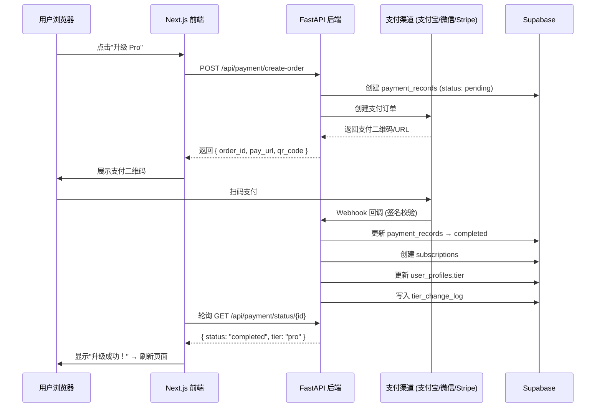

# StudySolo 付费与计费架构 · 实施指南

> 📅 创建日期：2026-02-27  
> 📌 所属模块：user_auth · VIP 会员  
> 🔗 关联文档：[vip-01-会员体系设计](./vip-01-membership-system-design.md) · [03-usage-quota-and-rate-limiting](./03-usage-quota-and-rate-limiting.md) · [PROJECT_PLAN](../../global/PROJECT_PLAN.md)  
> 🎯 定位：**StudySolo 支付集成、计费引擎、发票系统、退款策略的完整技术实施方案**

---

## 📑 目录

- [一、支付技术选型](#一支付技术选型)
- [二、支付流程架构](#二支付流程架构)
- [三、订阅生命周期管理](#三订阅生命周期管理)
- [四、加购项计费引擎](#四加购项计费引擎)
- [五、退款策略](#五退款策略)
- [六、发票与税务](#六发票与税务)
- [七、后端 API 设计](#七后端-api-设计)
- [八、安全与合规](#八安全与合规)
- [九、ACTION ITEMS](#九action-items)

---

## 一、支付技术选型

### 1.1 国内外支付分治策略

StudySolo 面向国内学生群体为主、海外留学生为辅，采用**国内境内支付 + 海外 Stripe**双通道：

| 覆盖区域 | 支付渠道 | 技术方案 | 支付方式 | 优先级 |
|:---|:---|:---|:---|:---:|
| **国内** | 支付宝 | 支付宝当面付/手机网站支付 SDK | 扫码付、支付宝APP | P0 |
| **国内** | 微信支付 | 微信 JSAPI/Native 支付 | 扫码付、微信内支付 | P0 |
| **海外** | Stripe | Stripe Checkout + Billing | 信用卡、Apple Pay、Google Pay | P1 |
| **国内(备用)** | PayJS 或 虎皮椒 | 聚合支付（个人可申请） | 支付宝+微信 | P2 备选 |

> ⚠️ **独立开发者注意**：支付宝/微信商户号需要个体工商户或公司资质。如果暂时没有，可先用 PayJS / 虎皮椒等个人聚合支付作为过渡。

### 1.2 为什么不全用 Stripe？

| 维度 | 国内直连 | Stripe |
|:---|:---|:---|
| 支付宝扫码 | ✅ 原生体验 | ⚠️ 需额外配置，体验差 |
| 微信支付 | ✅ 原生体验 | ❌ 不支持微信内 H5 支付 |
| 结算周期 | T+1 到账 | 7-14天跨境结算 |
| 手续费 | 0.6% | 2.9% + 30¢ |
| 适用场景 | 国内用户 ¥ | 海外用户 $ |

### 1.3 支付宝/微信个人方案（MVP 阶段）

如果 MVP 阶段尚未注册公司，可使用以下方案：

| 方案 | 费率 | 门槛 | 推荐度 |
|:---|:---:|:---|:---:|
| **PayJS** | 1.38% | 个人微信即可 | ⭐⭐⭐ MVP 推荐 |
| **虎皮椒** | 2% | 个人实名 | ⭐⭐ |
| **自建 H5 收款** | 0% | 需要自建 | ❌ 不推荐 |

---

## 二、支付流程架构

### 2.1 新用户订阅流程

```
用户点击 [立即升级 Pro]
    │
    ▼
前端打开 /pricing 页面
    │
    ├─ 选择方案：Pro / Pro+ / Ultra
    ├─ 选择周期：月付 / 年付 / 学期付
    ├─ 选择支付方式：支付宝 / 微信 / Stripe
    │
    ▼
前端 POST /api/payment/create-order
    │
    ├─── Body: { tier: "pro", plan: "monthly", payment_method: "alipay" }
    │
    ▼
后端 创建订单记录（payment_records 表，status: pending）
    │
    ├─── 调用支付宝/微信/Stripe API 生成支付链接
    │
    ▼
前端展示支付界面
    │
    ├─── 支付宝：二维码弹窗 或 跳转支付宝
    ├─── 微信：二维码弹窗 或 微信内唤起
    ├─── Stripe：Checkout Session 跳转
    │
    ▼
用户完成支付
    │
    ▼
支付渠道回调 → POST /api/payment/webhook
    │
    ├─── 验证签名（安全校验）
    ├─── 更新 payment_records 状态 → completed
    ├─── 创建 subscriptions 记录
    ├─── 更新 user_profiles.tier + user_profiles.tier_expires_at
    ├─── 记录 tier_change_log
    │
    ▼
前端轮询 /api/payment/status/{order_id}
    │
    └─── 检测到 completed → 跳转到成功页 → 刷新用户状态
```

### 2.2 时序图



### 2.3 自动续费流程

```
续费日前 3 天
    └─ 发送续费提醒邮件 + 站内通知
    
续费日当天 (Cron Job, 每日 UTC+8 06:00 执行)
    │
    ├─ 扫描 subscriptions 表：expires_at <= today + 1
    │
    ├─ 对每个需续费记录：
    │   ├─ auto_renew = true?
    │   │   ├─ YES → 调用支付渠道代扣
    │   │   │   ├─ 成功 → 延长 expires_at + 记录 payment_records
    │   │   │   └─ 失败 → renew_failed_count += 1
    │   │   │       ├─ 第 1 次失败 → 邮件通知"扣款失败，请更新支付方式"
    │   │   │       ├─ 第 2 次失败（次月）→ auto_renew = false, 订阅取消
    │   │   │       └─ 进入 grace_period 状态
    │   │   └─ NO → 进入过期流程
    │   │
    │   └─ 过期流程
    │       ├─ 更新 subscription.status = 'expired'
    │       ├─ 更新 user_profiles.tier = 'free'
    │       ├─ 记录 tier_change_log
    │       └─ 发送过期提醒邮件
```

---

## 三、订阅生命周期管理

### 3.1 状态机

```
           购买成功
    ┌─────────────────┐
    │                 ▼
    │          ╔═══════════╗
    │          ║  active   ║ ←──── 续费成功
    │          ╚═════╤═════╝
    │                │
    │     ┌──────────┼──────────┐
    │     │到期      │手动取消   │续费失败
    │     ▼          ▼          ▼
    │  ╔═══════╗  ╔════════╗  ╔═════════════╗
    │  ║expired║  ║cancelled║ ║grace_period ║
    │  ╚═══╤═══╝  ╚════════╝  ╚══════╤══════╝
    │      │                         │
    │      │ 重新购买                 │ 3天内补付
    │      └─────────────────────────┘
    │                │
    │                │ 超过宽限期
    │                ▼
    │         ╔════════════════╗
    │         ║pending_deletion║
    │         ╚═══════╤════════╝
    │                 │ 22天后
    │                 ▼
    │          数据永久删除
    └──(重新购买可从任何非永删状态恢复)
```

### 3.2 升级/降级策略

| 场景 | 处理方式 |
|:---|:---|
| **Free → Pro** | 立即生效，全额收费 |
| **Pro → Pro+** | 立即生效，按剩余天数折算差价 |
| **Pro+ → Ultra** | 立即生效，按剩余天数折算差价 |
| **Pro+ → Pro** | 当前周期结束后降级（即刻降级太不友好） |
| **Pro → Free** | 取消自动续费，当前周期结束后降级 |
| **月付 → 年付** | 立即切换，按剩余天数退还月付差价 |

### 3.3 升级差价计算

```python
def calculate_upgrade_price(
    current_tier: str,
    current_expires_at: datetime,
    new_tier: str,
    new_plan: str  # 'monthly' | 'yearly'
) -> Decimal:
    """计算升级差价"""
    remaining_days = (current_expires_at - datetime.now()).days
    
    # 当前方案每日价格
    current_daily = TIER_PRICES[current_tier] / 30
    current_remaining_value = current_daily * remaining_days
    
    # 新方案全价
    new_full_price = TIER_PRICES[new_tier] if new_plan == 'monthly' else TIER_ANNUAL[new_tier]
    new_period = 30 if new_plan == 'monthly' else 365
    
    # 差价 = 新方案全价 - 旧方案剩余价值
    upgrade_price = new_full_price - current_remaining_value
    
    return max(upgrade_price, Decimal('0'))  # 不能为负
```

---

## 四、加购项计费引擎

### 4.1 加购与订阅的关系

```
subscriptions (主订阅)
    │
    ├── addon_purchases (加购1: +5GB 存储)
    ├── addon_purchases (加购2: +10 工作流)
    └── addon_purchases (加购3: +1 并发)

规则：
  · 加购项独立计费周期
  · 主订阅过期 → 所有加购项同步失效
  · 主订阅续费 → 加购项不自动恢复（需手动或一键复购）
```

### 4.2 加购计费逻辑

```python
async def process_addon_purchase(
    user_id: str,
    addon_type: str,   # 'storage' | 'workflows' | 'concurrent'
    quantity: int,      # e.g. 5 (GB/个)
    tier_quantity: str  # e.g. '+5GB' → 用于匹配价格表
):
    # 1. 查找价格
    price = ADDON_PRICES[addon_type][tier_quantity]
    
    # 2. 检查用户是否有活跃订阅
    subscription = await get_active_subscription(user_id)
    if not subscription:
        raise HTTPException(400, "加购项需要活跃会员，请先购买会员")
    
    # 3. 加购过期日与主订阅对齐
    expires_at = subscription.expires_at
    
    # 4. 创建加购记录
    addon = await create_addon_purchase(
        user_id=user_id,
        subscription_id=subscription.id,
        addon_type=addon_type,
        quantity=quantity,
        unit_price=price / quantity,
        total_price=price,
        expires_at=expires_at
    )
    
    # 5. 创建支付订单
    payment = await create_payment(user_id, addon_purchase_id=addon.id, amount=price)
    
    return payment
```

### 4.3 配额实时计算

```python
async def get_effective_quota(user_id: str) -> EffectiveQuota:
    """计算用户的有效配额（套餐 + 所有活跃加购项）"""
    
    user = await get_user(user_id)
    tier_config = get_config().user_tiers[user.tier]
    
    # 基础配额
    base_storage = tier_config["storage_gb"]
    base_workflows = tier_config["max_workflows"]
    base_concurrent = tier_config["max_concurrent_runs"]
    
    # 叠加活跃的加购项
    addons = await get_active_addons(user_id)
    addon_storage = sum(a.quantity for a in addons if a.addon_type == 'storage')
    addon_workflows = sum(a.quantity for a in addons if a.addon_type == 'workflows')
    addon_concurrent = sum(a.quantity for a in addons if a.addon_type == 'concurrent')
    
    return EffectiveQuota(
        storage_gb=base_storage + addon_storage,
        max_workflows=base_workflows + addon_workflows if base_workflows != -1 else -1,
        max_concurrent=base_concurrent + addon_concurrent,
        daily_executions=tier_config["daily_execution_limit"]  # 不可加购
    )
```

---

## 五、退款策略

### 5.1 退款规则

| 场景 | 退款方式 | 退款金额 |
|:---|:---|:---|
| ¥1 试用期取消 | 全额退款 | ¥1 |
| 首月 ¥3 优惠期取消 | 全额退款 | ¥3 |
| 月付首月（3天内） | 无理由退款 | 全额 |
| 月付使用超过 3 天 | 不退款 | — |
| 年付首月（7天内） | 无理由退款 | 全额 |
| 年付超过首月 | 按已使用月数折算 | 年付金额 - 已用月×月付单价 |
| 支付异常/重复扣款 | 全额退款 | 重复部分 |

### 5.2 退款流程

```
用户申请退款 → POST /api/payment/refund
    │
    ├─ 审核退款条件（自动）
    │   ├─ 试用期 → 自动批准
    │   ├─ 3天内 → 自动批准
    │   └─ 超期 → 转人工审核
    │
    ├─ 计算退款金额
    │
    ├─ 调用支付渠道退款API
    │   ├─ 支付宝：原路退款
    │   ├─ 微信：原路退款
    │   └─ Stripe：Refund API
    │
    ├─ 更新 payment_records.status = 'refunded'
    ├─ 更新 subscriptions.status = 'cancelled'
    ├─ 降级 user_profiles.tier = 'free'
    └─ 记录 tier_change_log
```

---

## 六、发票与税务

### 6.1 电子发票

| 维度 | 方案 |
|:---|:---|
| 发票类型 | 增值税电子普通发票 |
| 开票方式 | 接入阿里云发票服务 或 航信诺诺 |
| 触发条件 | 用户在会员中心主动申请 |
| 抬头 | 支持个人（姓名+身份证后4位）和企业（公司名+税号） |
| 交付 | 发送至用户注册邮箱 + 站内下载 |

### 6.2 MVP 阶段简化方案

MVP 阶段可暂不接入自动开票系统：

1. 用户在会员中心填写开票信息
2. 系统发送邮件通知管理员
3. 管理员手动开票并发送至用户邮箱
4. 后续接入自动开票系统

---

## 七、后端 API 设计

### 7.1 支付相关 API

```python
# backend/app/api/payment.py

# === 订阅管理 ===
POST   /api/payment/create-order        # 创建支付订单
GET    /api/payment/status/{order_id}    # 查询支付状态
POST   /api/payment/webhook/{provider}  # 支付回调（公开，签名校验）

# === 订阅操作 ===  
GET    /api/subscription/current        # 获取当前订阅信息
POST   /api/subscription/upgrade        # 升级方案
POST   /api/subscription/cancel         # 取消自动续费
POST   /api/subscription/resume         # 恢复自动续费

# === 加购 ===
POST   /api/addon/purchase              # 购买加购项
GET    /api/addon/list                   # 查看已购加购项
DELETE /api/addon/{addon_id}/cancel      # 取消加购项

# === 退款 ===
POST   /api/payment/refund              # 申请退款

# === 配额查询 ===
GET    /api/user/quota                  # 查询当前有效配额
GET    /api/user/usage                  # 查看用量详情
```

### 7.2 Webhook 安全校验

```python
# backend/app/api/payment.py

@router.post("/api/payment/webhook/alipay")
async def alipay_webhook(request: Request):
    """支付宝异步通知"""
    body = await request.body()
    params = dict(parse_qsl(body.decode()))
    
    # 1. 验证签名（必须！防伪造回调）
    if not verify_alipay_signature(params):
        raise HTTPException(403, "签名验证失败")
    
    # 2. 验证订单金额（防篡改）
    order = await get_payment_record(params['out_trade_no'])
    if Decimal(params['total_amount']) != order.amount:
        raise HTTPException(400, "金额不匹配")
    
    # 3. 处理支付成功
    if params['trade_status'] == 'TRADE_SUCCESS':
        await process_payment_success(order)
    
    return Response("success")  # 支付宝要求返回 "success"


@router.post("/api/payment/webhook/stripe")
async def stripe_webhook(request: Request):
    """Stripe Webhook"""
    payload = await request.body()
    sig_header = request.headers.get('stripe-signature')
    
    try:
        event = stripe.Webhook.construct_event(
            payload, sig_header, settings.STRIPE_WEBHOOK_SECRET
        )
    except Exception:
        raise HTTPException(400, "Webhook 签名验证失败")
    
    if event['type'] == 'checkout.session.completed':
        await process_stripe_payment(event['data']['object'])
    elif event['type'] == 'invoice.payment_failed':
        await handle_renewal_failure(event['data']['object'])
    
    return {"received": True}
```

---

## 八、安全与合规

### 8.1 支付安全清单

| 安全项 | 实施方式 |
|:---|:---|
| **签名验证** | 所有 Webhook 必须验证支付渠道签名 |
| **金额校验** | 回调金额必须与订单金额一致 |
| **幂等处理** | 同一订单号的回调只处理一次（基于 payment_records 状态判断） |
| **HTTPS 必须** | 支付回调 URL 必须是 HTTPS |
| **敏感信息** | 不存储完整银行卡号、CVV。Stripe Token 化处理 |
| **日志审计** | 所有支付操作写入 payment_records + tier_change_log |
| **价格校验** | 服务端验证价格，不信任前端传来的金额 |

### 8.2 合规要求

| 合规项 | 状态 | 说明 |
|:---|:---:|:---|
| ICP 备案 | ✅ 已有 | 黑ICP备2025046407号-3 |
| 增值电信业务许可 | ⚠️ 待评估 | SaaS 订阅可能需要 |
| 用户协议 | 需编写 | 含付费条款、退款政策 |
| 隐私政策 | 需编写 | 符合个保法要求 |

---

## 九、ACTION ITEMS

| 优先级 | 任务 | 涉及文件 | 备注 |
|:---|:---|:---|:---|
| **P0** | 确定 MVP 支付方案（PayJS 或 支付宝商户） | 决策项 | 影响后续所有开发 |
| **P0** | 支付订单 API (create-order + webhook) | `backend/app/api/payment.py` | 核心支付链路 |
| **P0** | 订阅生命周期管理服务 | `backend/app/services/subscription.py` | 状态机 |
| **P1** | 支付宝/微信支付 SDK 集成 | `backend/app/services/payment/` | 对接支付渠道 |
| **P1** | 自动续费 Cron Job | `backend/app/tasks/renewal.py` | 每日执行 |
| **P1** | 前端支付流程 UI | `frontend/src/app/pricing/` | 二维码弹窗 |
| **P2** | Stripe 集成（海外用户） | `backend/app/services/payment/stripe.py` | 海外支付 |
| **P2** | 升级差价计算逻辑 | `backend/app/services/subscription.py` | 方案升级 |
| **P2** | 退款流程 | `backend/app/api/payment.py` | — |
| **P3** | 电子发票系统 | `backend/app/services/invoice.py` | 可 MVP 后接入 |

---

> **一句话总结**：国内支付宝/微信 + 海外 Stripe 双通道，Webhook 签名校验 + 金额核对 + 幂等处理三重安全，订阅状态机管理从 active 到 pending_deletion 的完整生命周期，加购项与主订阅联动但独立计费。
