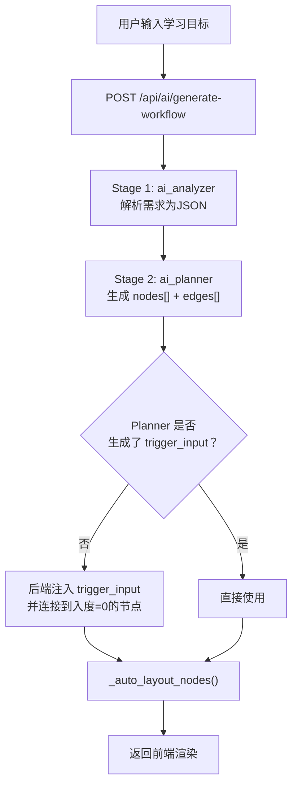
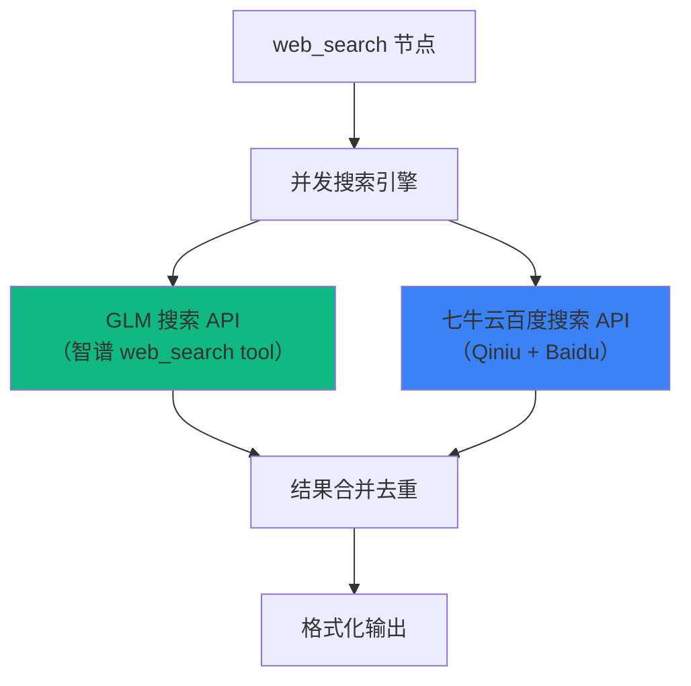

# 输入节点体系 & AI 面板提示词深度分析

> 分析时间：2026-03-27 21:05
> 状态：仅分析，不动代码

---

## 一、问题全景

用户提出 3 个核心诉求：

| # | 问题 | 严重性 |
|---|------|--------|
| 1 | AI 面板从 0 到 1 生成工作流时，**不保证首个节点是输入节点** | 🔴 架构缺陷 |
| 2 | AI 面板提示词体系**无架构**，缺乏结构化约束 | 🟡 质量短板 |
| 3 | 3 个输入节点**只是空壳**，搜索节点只接了 Tavily，知识库未验证端到端 | 🔴 功能缺失 |

---

## 二、问题 1：AI 面板生成流程不保证输入节点在前

### 2.1 当前流程图



### 2.2 实际问题定位

**后端** ([ai.py#L344-L376](file:///d:/project/Study_1037Solo/StudySolo/backend/app/api/ai.py#L344-L376)) 已经有兜底措施：

```python
# ── 自动注入 trigger_input（若 Planner 未生成） ──
has_trigger = any(n.type == "trigger_input" for n in enriched_nodes)
if not has_trigger:
    trigger_node = WorkflowNodeSchema(...)
    enriched_nodes.insert(0, trigger_node)
    # 找到入度=0的节点，从 trigger 连过去
```

✅ `trigger_input` 有兜底注入。

**但问题在于**：

1. **[knowledge_base](file:///d:/project/Study_1037Solo/StudySolo/backend/app/services/knowledge_service.py#141-169) 和 `web_search` 不在兜底范围**。Planner 的 prompt 只说"当用户提及'最新'时添加 web_search"，如果用户没有明确提及这些关键词，Planner 不会生成 these input 节点
2. **Planner prompt 缺少"输入节点必须在 DAG 最前端"的硬性规则**。当前 [prompt.md](file:///d:/project/Study_1037Solo/StudySolo/backend/app/nodes/analysis/ai_planner/prompt.md) 中仅有软性"在工作流头部添加"，没有 DAG 层的强制约束
3. **缺少"输入源分类"概念**——不区分"用户手动输入"、"知识库检索"、"联网搜索"三种数据源

### 2.3 改进方向

参考用户提供的**提示词架构参考**，应该在 Planner prompt 中注入：

- **L1 模板层**：明确 `trigger_input / knowledge_base / web_search` 是"输入源类"节点，必须作为 DAG 入口
- **L2 DAG 层**：强制 edges 中输入源节点入度=0，其余节点必须有显式依赖
- **ReAct 流程**：先 Thought 分析需要哪些输入源 → 再 Plan 节点 → 最后 Generate JSON

---

## 三、问题 2：AI 面板提示词体系缺乏架构

### 3.1 当前提示词体系现状

```
identity.md (43行)           ← 身份定义 + 节点类型表 + 安全规则
  ↓ 拼接
_base_prompt.md (23行)       ← 通用执行规则
  ↓ 拼接
nodes/*/prompt.md (各8-55行) ← 节点特定指令
```

三段式拼装是合理的，但问题：

| 层级 | 现状 | 问题 |
|------|------|------|
| [identity.md](file:///d:/project/Study_1037Solo/StudySolo/backend/app/prompts/identity.md) | 43 行，混合了身份、节点表、安全规则 | 节点类型表只列名称，**没有分类标签和约束规则** |
| [_base_prompt.md](file:///d:/project/Study_1037Solo/StudySolo/backend/app/nodes/_base_prompt.md) | 23 行 | 缺少 DAG 约束、输出 schema 约束 |
| [ai_analyzer/prompt.md](file:///d:/project/Study_1037Solo/StudySolo/backend/app/nodes/analysis/ai_analyzer/prompt.md) | 11 行 | 太简短，没有 ReAct 思维链引导 |
| [ai_planner/prompt.md](file:///d:/project/Study_1037Solo/StudySolo/backend/app/nodes/analysis/ai_planner/prompt.md) | 55 行 | **最关键的文件**，但缺少硬性 DAG 规则、输入节点优先级 |

### 3.2 对照提示词架构参考的差距

| 架构参考要求 | 当前实现 | 差距 |
|------------|---------|------|
| **L1 模板层**：角色定义 + 节点类型清单 + 输出格式约束 | ✅ 有角色、有节点表、有 JSON 约束 | ⚠️ 节点表缺少**分类标签**（输入源/分析/生成/输出） |
| **L2 DAG 层**：依赖规则、无环性、数据流方向 | ❌ 完全没有 | 🔴 Planner prompt 仅靠 LLM "常识"生成依赖 |
| **L3 Skill 层**：复杂节点的渐进式配置 | ❌ 完全没有 | 🟡 config_schema 在前端有但提示词未引导 LLM 填写 |
| **ReAct 流程**：Thought → Plan → Act → Generate | ❌ 完全没有 | 🔴 直接要求输出 JSON，无思维链 |
| **输出 Schema** 强制约束 | ⚠️ 有 Pydantic 验证但 prompt 中没给 schema | 🟡 LLM 靠猜生成结构 |

### 3.3 改进方向

```
新体系：

identity.md (不变)
  ↓
_base_prompt.md → 升级为包含：
  - 通用执行规则
  - DAG 层约束规则（无环性、数据流方向）
  ↓
ai_analyzer/prompt.md → 升级为：
  - L1 模板：输入/输出 JSON Schema
  - ReAct：要求先 Thought 再输出
  ↓
ai_planner/prompt.md → 大幅升级：
  - L1 模板：节点分类表（输入源/分析/生成/交互/输出/结构）
  - L2 DAG：硬性规则（输入源入度=0、write_db/export_file 无下游等）
  - L3 Skill：config 填写引导
  - ReAct：4步流程
  - 输出 JSON Schema 示例
```

---

## 四、问题 3：三个输入节点的实际有效性

### 4.1 `trigger_input` — ✅ 基本有效

[trigger_input/node.py](file:///d:/project/Study_1037Solo/StudySolo/backend/app/nodes/input/trigger_input/node.py)

```python
async def execute(self, node_input, llm_caller):
    config = node_input.node_config or {}
    output = node_input.user_content or config.get("input_template", "") or ""
    if output:
        yield output
```

**分析**：
- ✅ 逻辑正确：直接透传用户输入
- ✅ 支持 `input_template` 配置作为默认值
- ⚠️ 轻微问题：如果 [user_content](file:///d:/project/Study_1037Solo/StudySolo/backend/app/engine/executor.py#305-313) 和 `input_template` 全空，什么也不输出，下游节点会收到空字符串

### 4.2 [knowledge_base](file:///d:/project/Study_1037Solo/StudySolo/backend/app/services/knowledge_service.py#141-169) — ⚠️ 框架有，但端到端链路存疑

[knowledge_base/node.py](file:///d:/project/Study_1037Solo/StudySolo/backend/app/nodes/input/knowledge_base/node.py)

**调用链**：
```
KnowledgeBaseNode.execute()
  → get_db()
  → retrieve_knowledge_chunks(query, user_id, db, top_k, threshold)
    → knowledge_retriever.retrieve_chunks()
      → embed_text(query)  ← 使用 Aliyun Dashscope text-embedding-v3
      → db.rpc("match_kb_chunks", {...})  ← Supabase RPC pgvector 搜索
    → 按 document_ids 过滤
  → format_retrieval_context(results)
```

**分析**：

| 环节 | 状态 | 问题 |
|------|------|------|
| Embedding 服务 | ✅ 已实现 | 使用 Aliyun Dashscope `text-embedding-v3`, 1024 维 |
| pgvector RPC | ✅ SQL 迁移已存在 | `match_kb_chunks` 在 [20260325090000_create_knowledge_base_tables.sql](file:///d:/project/Study_1037Solo/StudySolo/supabase/migrations/20260325090000_create_knowledge_base_tables.sql) 中定义 |
| 文档处理流水线 | ✅ 已实现 | parse → chunk → embed → store 全链路 |
| **user_id 获取** | 🔴 **关键依赖** | 依赖 `implicit_context.user_id`，**需要确认执行引擎是否注入了 user_id** |
| document_ids 动态加载 | 🟡 待验证 | config_schema 设了 `dynamic_options: true`，但前端是否实现了动态选项加载？ |

**核心风险**：
```python
# knowledge_base/node.py L96-101
user_id = None
if node_input.implicit_context:
    user_id = node_input.implicit_context.get("user_id")
if not user_id:
    yield "⚠️ 无法确定用户身份，无法检索知识库"
    return
```

需要确认 [executor.py](file:///d:/project/Study_1037Solo/StudySolo/backend/app/engine/executor.py) 在调用 [execute_workflow()](file:///d:/project/Study_1037Solo/StudySolo/backend/app/engine/executor.py#433-672) 时，`implicit_context` 是否包含了 `user_id`。从 [executor.py](file:///d:/project/Study_1037Solo/StudySolo/backend/app/engine/executor.py) 看，`implicit_context` 是外部传入的，需要追溯 `workflow_execute.py` 端点。

### 4.3 `web_search` — 🔴 只有 Tavily，需重构为双引擎

[web_search/node.py](file:///d:/project/Study_1037Solo/StudySolo/backend/app/nodes/input/web_search/node.py)
[search_service.py](file:///d:/project/Study_1037Solo/StudySolo/backend/app/services/search_service.py)

**当前状态**：

| 项目 | 状态 |
|------|------|
| 搜索引擎 | **只有 Tavily**（需要 `TAVILY_API_KEY`）|
| GLM 搜索 | ❌ 完全没有 |
| 七牛云百度搜索 | ❌ 完全没有 |
| 模型选择 | 节点设了 `is_llm_node = False`，**用户无法手动选模型**（这符合需求） |
| 权威源约束 | ❌ 没有任何域名白名单或搜索指令约束 |

**用户要求的目标架构**：



**需要实现**：
1. 新建 `search_glm.py` — 对接 GLM (智谱) 的 web_search 工具回调
2. 新建 `search_baidu.py` — 对接七牛云百度搜索 API
3. 重构 [search_service.py](file:///d:/project/Study_1037Solo/StudySolo/backend/app/services/search_service.py) 为**聚合搜索引擎**：并发调用两者 → 结果合并去重
4. 搜索 query 中注入权威源指令：`site:baike.baidu.com OR site:cnki.net OR site:zhihu.com`（或在 API 参数中约束）
5. 移除 Tavily 单一依赖（或降级为第三选择）

---

## 五、改进路线图（建议分 3 个阶段）

### Phase 1：AI Planner 提示词架构升级（不改后端逻辑）

| 文件 | 改动 |
|------|------|
| [ai_planner/prompt.md](file:///d:/project/Study_1037Solo/StudySolo/backend/app/nodes/analysis/ai_planner/prompt.md) | 重写为 Template-DAG-Skill 三层结构 + ReAct 流程 |
| [ai_analyzer/prompt.md](file:///d:/project/Study_1037Solo/StudySolo/backend/app/nodes/analysis/ai_analyzer/prompt.md) | 增加输入源分类字段（need_knowledge_base, need_web_search） |
| [identity.md](file:///d:/project/Study_1037Solo/StudySolo/backend/app/prompts/identity.md) | 节点表增加分类标签列 |
| [_base_prompt.md](file:///d:/project/Study_1037Solo/StudySolo/backend/app/nodes/_base_prompt.md) | 增加 DAG 层约束规则 |

**Planner prompt 新结构预览**：

```
# L1 模板层 — 角色 + 节点分类表 + 输出 Schema
## 角色：你是 StudySolo 工作流架构师
## 节点分类表（含"分类"列：输入源/分析/生成/交互/输出/结构）
## 输出 JSON Schema（含 nodes[] + edges[]）

# L2 DAG 层 — 硬性规则
## 规则 1：工作流必须以输入源节点开始（trigger_input / knowledge_base / web_search）
## 规则 2：输入源节点入度必须=0
## 规则 3：write_db / export_file 出度必须=0
## 规则 4：edges 必须形成 DAG，禁止循环
## 规则 5：每个非输入源节点必须有至少一条入边

# L3 Skill 层 — 节点配置引导
## knowledge_base config：top_k, threshold, document_ids
## web_search config：max_results, search_depth
## quiz_gen config：types, count, difficulty

# ReAct 生成流程
## Step 1 - Thought：分析学习目标，判断需要哪些输入源
## Step 2 - Plan：匹配节点类型，画出依赖关系
## Step 3 - Validate：检查 DAG 合法性
## Step 4 - Generate：输出 JSON
```

### Phase 2：Web Search 双引擎重构

| 文件 | 改动 |
|------|------|
| `services/search_glm.py` | 新建：GLM web_search 工具调用 |
| `services/search_baidu.py` | 新建：七牛云百度搜索 API |
| [services/search_service.py](file:///d:/project/Study_1037Solo/StudySolo/backend/app/services/search_service.py) | 重构为聚合引擎：并发调用 → 合并去重 → 格式化 |
| [nodes/input/web_search/node.py](file:///d:/project/Study_1037Solo/StudySolo/backend/app/nodes/input/web_search/node.py) | 适配新的聚合搜索接口 |
| [nodes/input/web_search/prompt.md](file:///d:/project/Study_1037Solo/StudySolo/backend/app/nodes/input/web_search/prompt.md) | 更新说明 |
| `.env.example` | 新增 `GLM_API_KEY`, `QINIU_SEARCH_*` |

**搜索 query 权威源约束策略**：
```python
# 方案 A：在 query 中追加 site 限定
enhanced_query = f"{query} site:baike.baidu.com OR site:cnki.net OR site:gov.cn"

# 方案 B：在 API 参数中设置域名白名单（如果 API 支持）
include_domains = ["baike.baidu.com", "cnki.net", "zhihu.com", "gov.cn"]

# 方案 C：在结果后处理中过滤非权威来源
BLOCKLIST = ["csdn.net 非官方", "百家号", "搜狐号"]
```

### Phase 3：Knowledge Base 端到端验证 + 补全

| 检查项 | 状态 | 行动 |
|--------|------|------|
| `implicit_context` 中是否有 `user_id` | 🔍 需验证 | 追溯 `workflow_execute.py` |
| `match_kb_chunks` RPC 是否已部署到生产 Supabase | 🔍 需验证 | 检查迁移状态 |
| 文档上传 → 处理 → embedding 存储链路 | 🔍 需验证 | 上传测试文档端到端测试 |
| 前端 `dynamic_options` 文档列表加载 | 🔍 需验证 | 检查 NodeConfigDrawer |

---

## 六、关键文件清单（实施时需要修改的文件）

```
后端（Phase 1 - 提示词）：
├── backend/app/nodes/analysis/ai_planner/prompt.md     ← 核心重写
├── backend/app/nodes/analysis/ai_analyzer/prompt.md     ← 增加输入源字段
├── backend/app/prompts/identity.md                      ← 节点表加分类
├── backend/app/nodes/_base_prompt.md                    ← 加 DAG 规则

后端（Phase 2 - 搜索引擎）：
├── backend/app/services/search_service.py               ← 重构为聚合引擎
├── backend/app/services/search_glm.py                   ← 新建
├── backend/app/services/search_baidu.py                 ← 新建
├── backend/app/nodes/input/web_search/node.py           ← 适配
├── backend/app/nodes/input/web_search/prompt.md         ← 更新

后端（Phase 3 - 知识库验证）：
├── backend/app/api/workflow_execute.py                  ← 确认 user_id 注入
├── backend/app/nodes/input/knowledge_base/node.py       ← 可能需微调
├── supabase/migrations/                                 ← 确认 RPC 部署状态

前端：
├── frontend/src/features/workflow/components/panel/WorkflowPromptInput.tsx  ← 可能优化交互
```

---

## 七、结论

| 维度 | 当前评分 | 目标评分 |
|------|---------|---------|
| AI 生成可靠性（输入节点保证） | ⭐⭐ (Planner 靠"常识") | ⭐⭐⭐⭐⭐ (DAG 硬性规则 + 后端兜底) |
| 提示词体系成熟度 | ⭐⭐ (扁平三段拼接) | ⭐⭐⭐⭐ (Template-DAG-Skill + ReAct) |
| 知识库检索有效性 | ⭐⭐⭐ (代码完整但未端到端验证) | ⭐⭐⭐⭐⭐ (验证 + 补全 user_id 注入) |
| 联网搜索有效性 | ⭐ (仅 Tavily, 无权威源约束) | ⭐⭐⭐⭐⭐ (GLM+百度双引擎 + 权威源过滤) |

> **建议先做 Phase 1（提示词架构升级），因为它不改后端逻辑、风险最低、效果最直接。**
