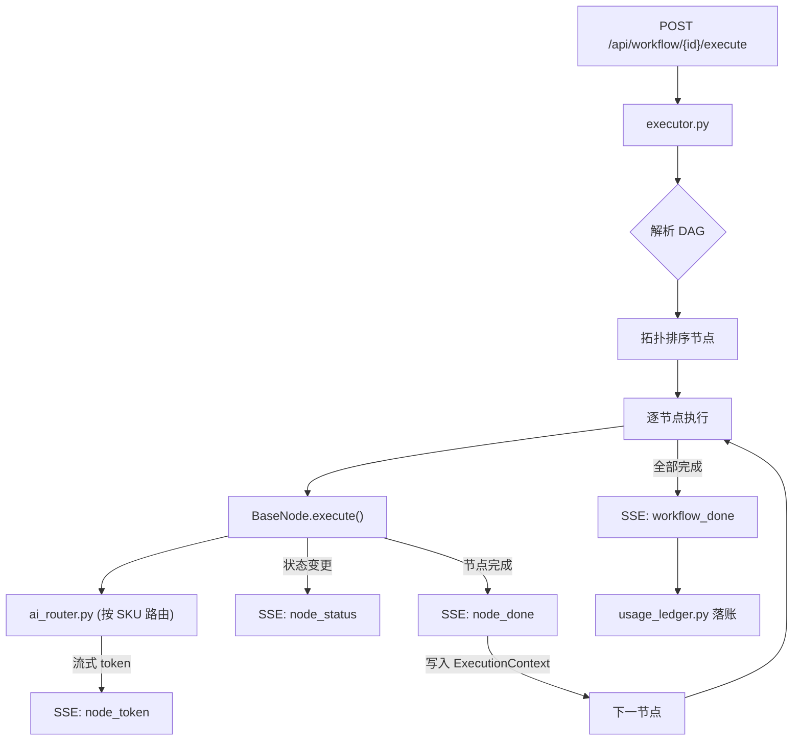

---

## 四、后端架构 (backend/app/)

### 4.1 目录结构

```
backend/app/
├── main.py                     # FastAPI 入口 & 中间件注册
├── core/
│   ├── config.py               # 环境变量 (pydantic-settings)
│   ├── config_loader.py        # YAML 运行时配置加载
│   ├── database.py             # Supabase 客户端初始化
│   └── deps.py                 # FastAPI 依赖注入 (auth/admin/rate-limit)
├── middleware/
│   ├── auth.py                 # JWT Token 验证 & membership_tier 挂载
│   ├── admin_auth.py           # 管理员独立认证 (bcrypt 体系)
│   └── security.py             # CORS + 安全响应头
├── api/                        # HTTP 路由层 (27 个路由文件)
│   ├── router.py               # ⭐ 统一路由注册中心
│   ├── auth/                   # 认证路由包
│   │   ├── login.py            # 登录 + token 刷新 + 登出 (11KB)
│   │   ├── register.py         # 注册 + 邮件验证 (6KB)
│   │   ├── captcha.py          # 拼图验证码 (7KB)
│   │   └── _helpers.py         # 认证辅助函数 (3.8KB)
│   ├── workflow.py             # 工作流 CRUD (7.4KB)
│   ├── workflow_execute.py     # ⭐ SSE 执行触发器 (6.6KB)
│   ├── workflow_social.py      # 点赞/收藏/公开/Marketplace (9.6KB)
│   ├── workflow_collaboration.py  # 协作者邀请/权限/移除 (10KB)
│   ├── ai.py                   # AI 生成工作流 + 推理 (13KB)
│   ├── ai_catalog.py           # 模型目录查询 (用户侧 SKU)
│   ├── ai_chat.py              # AI 会话 (非流式) (9KB)
│   ├── ai_chat_stream.py       # AI 会话 (SSE 流式) (8.8KB)
│   ├── nodes.py                # 节点元数据 API
│   ├── knowledge.py            # 知识库 CRUD & 向量查询 (6.9KB)
│   ├── exports.py              # 文件导出
│   ├── feedback.py             # 用户反馈 (6.1KB)
│   ├── usage.py                # Usage 统计 (overview/live/timeseries)
│   ├── admin_auth.py           # 管理员登录 (9.2KB)
│   ├── admin_dashboard.py      # 仪表盘数据 (9.7KB)
│   ├── admin_users.py          # 用户管理 (11.4KB)
│   ├── admin_notices.py        # 公告 CRUD (12.7KB)
│   ├── admin_workflows.py      # 工作流监控 (7.9KB)
│   ├── admin_models.py         # AI 模型目录配置 (2.1KB)
│   ├── admin_members.py        # 管理员账户管理 (5.8KB)
│   ├── admin_ratings.py        # 评分统计 (4.7KB)
│   ├── admin_config.py         # 系统配置 (3.8KB)
│   └── admin_audit.py          # 审计日志 (3.2KB)
├── models/                     # Pydantic 数据契约
│   ├── workflow.py             # WorkflowCreate/Update/Response (3KB)
│   ├── ai.py                   # AIGenerateRequest/Response (5.6KB)
│   ├── ai_catalog.py           # CatalogSku / FamilyGroup (1.7KB)
│   ├── ai_chat.py              # ChatRequest/Response (2.9KB)
│   ├── usage.py                # UsageEvent/Ledger/Analytics (2.9KB)
│   ├── knowledge.py            # KnowledgeBase/File 模型
│   ├── notice.py               # Notice CRUD 模型 (3.6KB)
│   ├── user.py                 # UserProfile / TierType (1.4KB)
│   └── admin.py                # Admin 请求/响应模型 (2KB)
├── engine/                     # ⭐ 工作流执行引擎
│   ├── executor.py             # DAG 图遍历 + SSE 流式调度 (24KB)
│   ├── context.py              # ExecutionContext (节点间数据传递)
│   ├── events.py               # SSE 事件类型定义
│   └── sse.py                  # SSE 辅助函数
├── nodes/                      # ⭐ 节点插件架构
│   ├── _base.py                # BaseNode 抽象基类 (7KB)
│   ├── _categories.py          # 节点分类枚举
│   ├── _mixins.py              # 可复用 Mixin (3KB)
│   ├── CONTRIBUTING.md         # 节点开发规范 (22KB)
│   ├── input/
│   │   ├── trigger_input/      # 用户输入触发节点
│   │   ├── knowledge_base/     # 知识库检索 (pgvector)
│   │   └── web_search/         # 网络搜索节点
│   ├── analysis/
│   │   ├── ai_analyzer/        # AI 需求分析
│   │   ├── ai_planner/         # AI 工作流规划
│   │   ├── logic_switch/       # 条件分支 (P2)
│   │   └── loop_map/           # 循环映射 (P2)
│   ├── generation/
│   │   ├── outline_gen/        # 大纲生成
│   │   ├── content_extract/    # 内容提炼
│   │   ├── summary/            # 摘要生成
│   │   ├── flashcard/          # 闪卡生成
│   │   ├── quiz_gen/           # 测验题生成
│   │   ├── mind_map/           # 思维导图
│   │   ├── compare/            # 对比分析
│   │   └── merge_polish/       # 合并润色
│   ├── interaction/
│   │   └── chat_response/      # 用户回复交互
│   └── output/
│       ├── export_file/        # 文件导出
│       └── write_db/           # 知识库写入
├── services/                   # 横向业务服务层
│   ├── ai_router.py            # ⭐ AI 多平台路由调度 (16KB)
│   ├── ai_catalog_service.py   # 模型目录读写 (7KB)
│   ├── usage_ledger.py         # ⭐ Usage 落账 (10KB)
│   ├── usage_analytics.py      # Usage 统计查询 (16KB)
│   ├── knowledge_service.py    # 知识库 CRUD facade (4.9KB)
│   ├── knowledge_retriever.py  # 向量检索 (pgvector) (3.2KB)
│   ├── embedding_service.py    # 文本向量化 (2.3KB)
│   ├── search_service.py       # 搜索服务 (4.3KB)
│   ├── text_chunker.py         # 文本分块策略 (6.3KB)
│   ├── file_parser.py          # PDF/DOCX/MD 解析 (5.6KB)
│   ├── file_converter.py       # 文件格式转换 (9.5KB)
│   ├── email_service.py        # 阿里云 DirectMail (9.4KB)
│   ├── document_service.py     # 文档处理 facade
│   └── audit_logger.py         # 审计日志记录 (4KB)
├── prompts/                    # AI Prompt 模板库
└── utils/                      # 通用工具函数
```

### 4.2 工作流执行引擎流程



### 4.3 SSE 事件契约

| 事件类型 | 载荷字段 | 说明 |
|----------|----------|------|
| `node_status` | `node_id`, `status`, `error?` | 节点状态变更 (pending→running→done/error/skipped) |
| `node_input` | `node_id`, `input_snapshot` | 节点输入快照 (JSON 字符串) |
| `node_token` | `node_id`, `token` | AI 流式吐字 |
| `node_done` | `node_id`, `full_output` | 节点完成 + 完整输出 |
| `loop_iteration` | `group_id`, `iteration`, `total` | 循环块进度 |
| `workflow_done` | `workflow_id`, `status`, `error?` | 整体完成 |
| `save_error` | `workflow_id`, `error` | 持久化失败 |

### 4.4 AI 多平台路由矩阵

| 平台标识 | 名称 | 类型 | 主要用途 |
|---------|------|------|---------|
| `dashscope` | 阿里云百炼 | native | Qwen 系列，中文主力 |
| `deepseek` | DeepSeek 官方 | native | 推理型 (R1)，深度思考 |
| `moonshot` | 月之暗面 | native | 长上下文 128K |
| `volcengine` | 火山引擎 | native | Doubao 系列补充 |
| `zhipu` | 智谱 AI | native | GLM / OCR 能力 |
| `qiniu` | 七牛云 | proxy | Kimi K2.5，搜索能力 |
| `siliconflow` | 硅基流动 | proxy | Qwen-72B 高性能推理 |
| `compshare` | 优云智算 | proxy | 备选通道 (别名: youyun) |

**路由策略**:
- `native_first`: 优先直连，失败后降级
- `proxy_first`: 优先走代理 (成本优化)
- `capability_fixed`: 固定分配 (搜索/OCR 专属)

**特殊任务路由 (config.yaml)**:
- `merge_polish` → `proxy_first` (qiniu_kimi_k2_5 / moonshot_128k)
- `premium_chat` → `proxy_first` (qiniu_qwen3_max / siliconflow_qwen_72b)
- `search` → `capability_fixed` (qiniu_search + zhipu_search_expansion)
- `ocr` → `capability_fixed` (zhipu_glm_ocr)

**引擎全局限制** (config.yaml engine 块):
```yaml
engine:
  timeout_ms: 30000
  max_retries: 3
  max_nodes_per_workflow: 12
  json_validation_retries: 3
```
