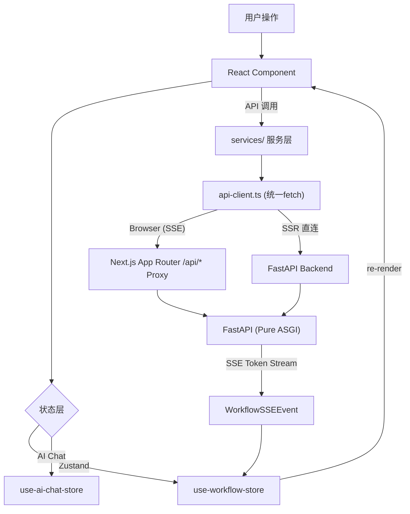
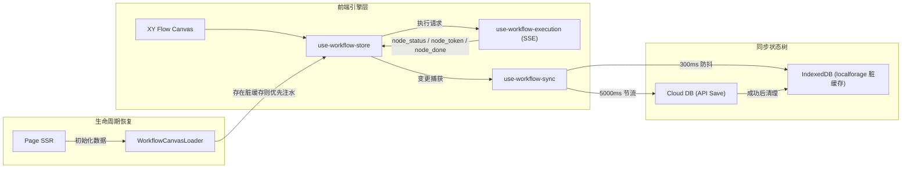
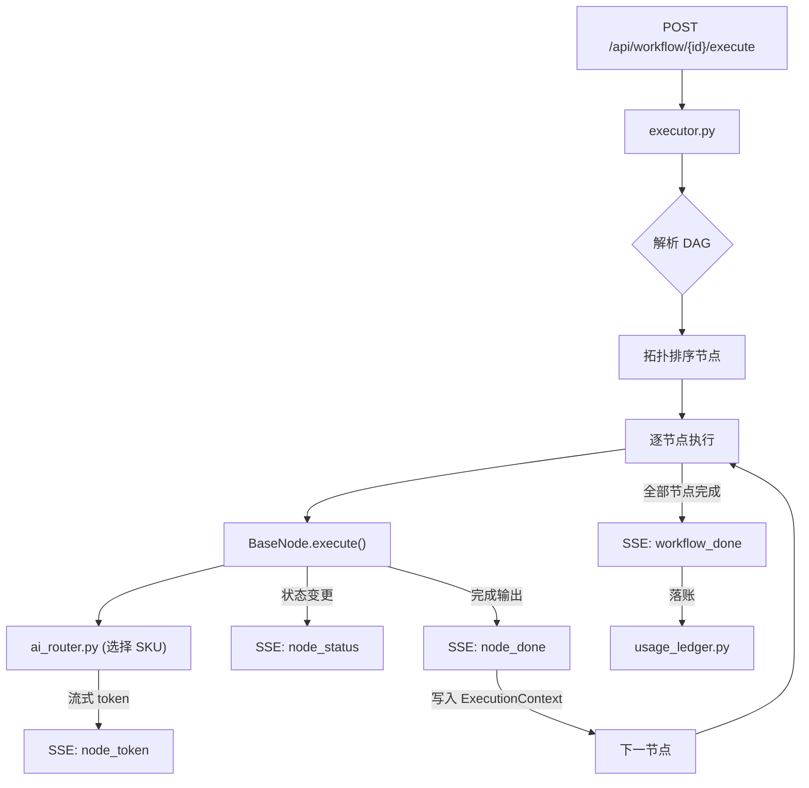

# StudySolo 项目架构全景

> **最后更新**: 2026-03-26 · 全面同步工作流协作系统、公开分享双路由、AI Catalog SKU 计费体系、知识库向量检索、Admin 完整化
> **事实源**: `frontend/package.json`、`backend/requirements.txt`、`backend/app/api/router.py`、`frontend/src/types/workflow.ts`、`backend/config.yaml`、`supabase/migrations/*`、`.gitmodules`

---

## 一、项目定位

StudySolo 是 1037Solo 生态旗下的 **AI 学习工作流引擎平台**。用户在可视化画布中拖拽编排学习节点（摘要、大纲、闪卡、测验、思维导图等），后端通过 DAG 执行引擎按拓扑顺序调用 AI 模型，结果经 **SSE 实时回流**到前端，最终写入知识库、导出文件或记录计费账本。

### 核心生命周期

```
[前端画布] 编排节点 & 连线
    ↓ POST /api/workflow/{id}/execute
[后端引擎] DAG 拓扑排序 → 逐节点调度
    ↓ AI Router (config.yaml + ai_model_skus)
[AI 多平台] dashscope / deepseek / moonshot / volcengine / zhipu / qiniu / siliconflow / compshare
    ↓ SSE 事件流 (node_status / node_token / node_done / workflow_done)
[前端 Store] use-workflow-store 即时更新节点状态与输出
    ↓ 并行
[数据层] usage_ledger 落账 → pgvector 向量写入 → 文件导出
```

### 技术栈一览

| 层级 | 技术 | 版本/来源 |
|------|------|-----------|
| **Frontend** | Next.js (App Router + Turbopack) | 16.1.6 |
| **UI 核心** | React 19.2.3 + Tailwind CSS v4 + Radix UI | — |
| **状态管理** | Zustand | 5.0.11 |
| **可视化画布** | @xyflow/react | 12.10.1 |
| **图标库** | Lucide React | 0.575.0 |
| **流式渲染** | react-markdown + Shiki + KaTeX + Streamdown | — |
| **图表** | Recharts | 2.x |
| **动画** | Framer Motion | 12.38.0 |
| **字体** | Inter / JetBrains Mono / Noto Sans SC / Noto Serif SC (fontsource-variable) | — |
| **测试** | Vitest 4 + fast-check | 4.0.18 |
| **Backend** | FastAPI + Uvicorn/Gunicorn | ≥0.115 |
| **数据模型** | Pydantic | ≥2.10 |
| **数据库** | Supabase (PostgreSQL + Auth + RLS + pgvector) | — |
| **AI SDK** | OpenAI SDK（多平台路由） | ≥1.60 |
| **SSE** | sse-starlette | ≥2.2 |
| **限流** | SlowAPI | ≥0.1.9 |
| **文档解析** | pypdf + python-docx + markdown | — |
| **邮件** | 阿里云 DirectMail (email_service.py) | — |
| **共享层** | shared/ (Git Submodule) | — |
| **CI/CD** | GitHub Actions → Aliyun ECS (Baota Panel) | — |

---

## 二、仓库顶层结构

```
StudySolo/
├── frontend/          # Next.js 前端 (port 2037)
├── backend/           # FastAPI 后端 (port 2038)
├── shared/            # 跨项目共享类型 (Git Submodule → .gitmodules)
├── supabase/          # 数据库 migrations (全栈单一真实数据源)
│   └── migrations/    # Baseline-Squash + 增量 SQL
├── scripts/           # 启动脚本 & 部署工具
│   └── start-studysolo.ps1   # PowerShell 一键全栈启动器
├── docs/              # 项目文档 (规范/架构/API/设计)
└── .agent/            # AI Agent 技能树 / workflows / scripts
```

> **共享层说明**: `shared/` 在本仓库是 **Git Submodule**（事实源：`.gitmodules`）。
> 而在 Platform Monorepo 视角，`StudySolo/` 作为 **Git Subtree** 存在。两者概念不可混写。

---

## 三、前端架构 (frontend/src/)

### 3.1 目录架构 — Feature-Based Layered (DDD 切片)

```
frontend/src/
├── app/                        # Next.js App Router 路由层
│   ├── layout.tsx              # Root Layout (ThemeProvider + TopLoader + Toaster)
│   ├── page.tsx                # Landing Page (/)
│   ├── globals.css             # 全局 CSS 入口
│   ├── not-found.tsx           # 404 页
│   ├── error.tsx               # 错误边界
│   │
│   ├── (auth)/                 # 认证路由组 (无 Layout)
│   │   ├── login/              # 登录页
│   │   ├── register/           # 注册页
│   │   ├── forgot-password/    # 忘记密码
│   │   └── reset-password/     # 重置密码
│   │
│   ├── auth/                   # Supabase Auth 回调
│   │   └── callback/           # OAuth callback handler
│   │
│   ├── (dashboard)/            # 登录后主面板 (DashboardShell)
│   │   ├── layout.tsx          # Dashboard Layout (Navbar + MobileNav)
│   │   ├── workspace/          # 工作流工作台
│   │   │   ├── page.tsx        # 工作流列表 (WorkflowList)
│   │   │   ├── loading.tsx     # 骨架加载态
│   │   │   └── [id]/           # 单工作流编辑区
│   │   │       └── page.tsx    # ⭐ SSR 数据获取 + 画布挂载入口
│   │   ├── c/                  # 私有画布编辑器路由 (/c/[id])
│   │   │   └── [id]/           # (受 middleware.ts 保护，需 access_token)
│   │   ├── knowledge/          # 知识库管理
│   │   └── settings/           # 用户设置
│   │       └── page.tsx
│   │
│   ├── s/                      # 公开分享视图 (/s/[id])
│   │   └── [id]/               # 脱敏只读工作流画布 (无需登录)
│   │
│   ├── upgrade/                # 升级会员页面
│   │
│   └── (admin)/                # 管理后台路由组
│       └── admin-analysis/     # 管理后台入口
│           ├── layout.tsx      # AdminSidebar + AdminTopbar
│           ├── dashboard/      # 统计仪表盘
│           ├── users/          # 用户管理
│           ├── workflows/      # 工作流监控
│           ├── notices/        # 公告 CRUD
│           ├── ratings/        # 评分统计
│           ├── members/        # 管理员账户
│           ├── models/         # AI 模型目录配置
│           ├── config/         # 系统配置
│           ├── audit/          # 审计日志
│           └── login/          # 管理员登录
│
├── features/                   # 业务功能模块 (核心领域切片)
│   │
│   ├── workflow/               # ⭐ 工作流编辑器完整域
│   │   ├── index.ts            # Barrel export
│   │   ├── components/
│   │   │   ├── canvas/         # 画布主容器
│   │   │   │   ├── WorkflowCanvas.tsx          # ⭐ XY Flow 核心 (27KB)
│   │   │   │   ├── CanvasMiniMap.tsx            # 小地图 (含右键菜单)
│   │   │   │   ├── CanvasModal.tsx              # 全局对话框容器
│   │   │   │   ├── CanvasContextMenu.tsx        # 画布空白右键菜单
│   │   │   │   ├── NodeContextMenu.tsx          # 节点右键菜单
│   │   │   │   ├── EdgeContextMenu.tsx          # 边右键菜单
│   │   │   │   ├── CanvasTraceLoader.tsx        # Magic Wand 流式动画加载器
│   │   │   │   └── edges/
│   │   │   │       ├── SequentialEdge.tsx       # 顺序边 (带标注/等待时间UI)
│   │   │   │       └── AnimatedEdge.tsx         # 执行中动态流光边
│   │   │   │
│   │   │   ├── nodes/          # 节点 UI 组件库
│   │   │   │   ├── AIStepNode.tsx               # ⭐ 通用 AI 节点外壳 (Shell+Slot)
│   │   │   │   ├── LoopGroupNode.tsx            # 循环容器块节点
│   │   │   │   ├── AnnotationNode.tsx           # 标注节点 (Emoji)
│   │   │   │   ├── GeneratingNode.tsx           # 生成中占位节点
│   │   │   │   ├── NodeSkeleton.tsx             # 骨架占位
│   │   │   │   ├── NodeModelSelector.tsx        # ⭐ 模型选择器插槽 (data-driven)
│   │   │   │   ├── NodeInputBadges.tsx          # 输入徽章 (展示 input_snapshot)
│   │   │   │   ├── NodeResultSlip.tsx           # 结果卡片 (展示 full_output)
│   │   │   │   ├── NodeMarkdownOutput.tsx       # Markdown 渲染层
│   │   │   │   ├── ShikiCodeBlock.tsx           # Shiki 代码高亮块
│   │   │   │   ├── BranchManagerPanel.tsx       # ⭐ 分支管理面板 (logic_switch)
│   │   │   │   ├── index.ts                     # 节点注册表
│   │   │   │   └── renderers/                   # 专用渲染器目录
│   │   │   │
│   │   │   ├── toolbar/        # 悬浮工具栏
│   │   │   │   ├── FloatingToolbar.tsx          # 主工具栏 (交互模式/搜索/标注)
│   │   │   │   ├── CanvasPlacementPanel.tsx     # 节点放置面板
│   │   │   │   ├── SearchBar.tsx                # 节点全局搜索覆盖层
│   │   │   │   ├── EmojiPicker.tsx              # Emoji 标注选择器
│   │   │   │   └── RunButton.tsx                # 执行触发按钮
│   │   │   │
│   │   │   └── panel/          # AI 侧边面板
│   │   │       ├── WorkflowPromptInput.tsx      # AI 提示词输入框
│   │   │       └── BottomDrawer.tsx             # 底部抽屉容器
│   │   │
│   │   ├── constants/
│   │   │   ├── workflow-meta.ts  # ⭐ 节点元数据 (图标/颜色/描述/分类) (15KB)
│   │   │   └── ai-models.ts      # AI 模型前端常量
│   │   │
│   │   ├── hooks/              # 工作流专用业务 Hooks
│   │   │   ├── use-workflow-sync.ts          # ⭐ 双向同步引擎 (IndexedDB脏缓存+云端心跳)
│   │   │   ├── use-workflow-execution.ts     # SSE 执行流控制
│   │   │   ├── use-action-executor.ts        # 节点操作统一执行器 (8KB)
│   │   │   ├── use-canvas-context.ts         # 画布上下文 (zoom/pan/selection)
│   │   │   ├── use-conversation-store.ts     # AI 对话历史管理
│   │   │   ├── use-stream-chat.ts            # AI 流式聊天
│   │   │   ├── use-workflow-catalog.ts       # 工作流目录查询
│   │   │   ├── use-create-workflow-action.ts # 新建工作流操作
│   │   │   ├── use-workflow-sidebar-actions.ts # 侧边栏按钮交互
│   │   │   ├── use-workflow-context-menu.ts  # 右键菜单状态
│   │   │   └── use-loop-group-drop.ts        # 循环组拖入逻辑
│   │   │
│   │   └── utils/              # 工作流工具函数
│   │       ├── edge-actions.ts             # 边的增删改逻辑
│   │       ├── edge-display.ts             # 边的显示属性计算
│   │       ├── intent-classifier.ts        # AI 意图分类器
│   │       ├── loop-group-drop.ts          # 循环组放入逻辑
│   │       ├── node-reference-resolver.ts  # 节点引用解析 (6KB)
│   │       ├── parse-plan-xml.ts           # AI 规划 XML 解析 (5KB)
│   │       └── parse-thinking.ts          # 思考链解析
│   │
│   ├── auth/                   # 认证域
│   │   ├── components/         # LoginForm, RegisterForm 等
│   │   ├── forms/              # 表单子组件
│   │   └── constants.ts        # 验证规则常量
│   │
│   ├── knowledge/              # 知识库域
│   │   ├── components/         # 上传/列表/查询组件
│   │   ├── hooks/              # useKnowledgeList 等
│   │   ├── types.ts            # 知识库类型
│   │   └── utils.ts            # 文件处理工具
│   │
│   ├── settings/               # 用户设置域
│   │   ├── SettingsPageView.tsx
│   │   ├── components/         # 设置面板组件
│   │   └── options.ts          # 配置选项枚举
│   │
│   └── admin/                  # 后台管理域
│       ├── shared/             # ⭐ 共享组件库
│       │   ├── index.ts        # Barrel export
│       │   ├── utils.ts        # formatDate/Duration, truncateId, maskEmail
│       │   ├── badges.ts       # TIER/NOTICE_STATUS 徽章
│       │   ├── components.tsx  # PageHeader, KpiCard, Pagination, StatusBadge
│       │   ├── AdminSidebar.tsx
│       │   └── AdminTopbar.tsx
│       ├── hooks/              # useAdminSidebarNavigation
│       ├── dashboard/          # 仪表盘图表 (Recharts)
│       ├── users/              # 用户管理 (列表/详情/操作)
│       ├── workflows/          # 工作流监控
│       ├── notices/            # 公告 CRUD
│       ├── ratings/            # 评分表格
│       ├── members/            # 管理员账户
│       ├── billing/            # 计费概览
│       ├── config/             # 系统配置
│       └── audit/              # 审计日志
│
├── components/                 # 跨域通用组件
│   ├── layout/
│   │   ├── Sidebar.tsx         # 主侧边栏 (含 Feedback 问卷入口) (14KB)
│   │   ├── Navbar.tsx          # 顶部导航栏
│   │   ├── NavbarAutoHide.tsx  # 自动隐藏导航栏包装
│   │   ├── MobileNav.tsx       # 移动端底部导航
│   │   ├── DashboardShell.tsx  # 仪表盘外壳 (Navbar + MobileNav)
│   │   ├── DashboardContentLayout.tsx # 内容区布局 (sidebar position mirror)
│   │   ├── RightPanel.tsx      # 右侧 AI 面板
│   │   ├── ResizableHandle.tsx # 可拖拽分隔条
│   │   ├── ThemeProvider.tsx   # 主题上下文
│   │   ├── ThemeToggle.tsx     # 明暗切换按钮
│   │   ├── CollapsibleSection.tsx
│   │   └── sidebar/            # 侧边栏子组件
│   └── ui/                     # shadcn/ui 基础组件 (直角 Ink & Parchment 适配)
│
├── services/                   # ⭐ 统一 API 服务层
│   ├── api-client.ts           # 统一 fetch 基础 (credentialsFetch/authedFetch/parseApiError)
│   ├── auth.service.ts         # 登录/注册/登出/密码重置
│   ├── auth-session.service.ts # 会话管理 & token 刷新
│   ├── auth-credentials.service.ts # 验证码相关
│   ├── workflow.service.ts     # 工作流 CRUD + 协作 + 社交
│   ├── workflow.server.service.ts  # Server-only 工作流服务 (SSR)
│   ├── collaboration.service.ts    # 协作者邀请/移除/权限
│   ├── ai-catalog.service.ts   # AI 模型目录 (SKU 列表)
│   ├── usage.service.ts        # Usage 统计查询
│   └── admin.service.ts        # 管理后台全量 API
│
├── stores/                     # Zustand 状态切片
│   ├── use-workflow-store.ts   # ⭐ 工作流全状态 (nodes/edges/execution) (9KB)
│   ├── use-ai-chat-store.ts    # AI 聊天对话状态 (10KB)
│   ├── use-panel-store.ts      # 右侧面板开关状态
│   ├── use-settings-store.ts   # 主题 & 用户偏好 (sidebarPosition 等)
│   └── use-admin-store.ts      # 后台 sidebar toggle
│
├── hooks/                      # 通用跨域 Hooks
│   ├── use-sidebar-navigation.ts     # 用户端侧边栏导航
│   ├── use-toast-queue.ts            # Toast 消息队列
│   └── use-verification-countdown.ts # 验证码倒计时
│
├── types/                      # TypeScript 权威类型定义
│   ├── index.ts                # Barrel export
│   ├── workflow.ts             # ⭐ WorkflowNode/Edge/NodeType/NodeStatus 等
│   ├── workflow-events.ts      # WorkflowSSEEvent (7种事件)
│   ├── ai-catalog.ts           # CatalogSku / BillingChannel / RoutingPolicy
│   ├── usage.ts                # UsageMetrics / UsageOverviewResponse 等
│   ├── auth.ts                 # 认证相关类型
│   ├── settings.ts             # 设置类型
│   ├── async.ts                # AsyncState 等
│   └── admin/                  # 后台管理类型目录
│
├── utils/                      # 工具函数
│   ├── date.ts                 # 日期格式化
│   └── supabase/               # Supabase 客户端 (browser + server)
│
├── lib/                        # 第三方库配置
├── styles/                     # 全局样式
└── __tests__/                  # 单元测试 (Vitest)
```

### 3.2 路由保护机制 (middleware.ts)

```
middleware.ts 拦截规则:
  /c/:path*     → 需要 access_token cookie → 否则 redirect /login?redirect=...
  /workspace/*  → 需要 access_token cookie → 否则 redirect /login?redirect=...
  /s/:path*     → 公开访问，无需认证
  /             → 公开访问
```

### 3.3 数据流架构



### 3.4 工作流编辑器 — 同步双轨架构



### 3.5 认证流

| 步骤 | 说明 |
|------|------|
| 1 | 用户通过 `(auth)/login` 登录 → `auth.service.ts` |
| 2 | Supabase Auth 验证 → 返回 `access_token` + `refresh_token` |
| 3 | `auth-session.service.ts` 存入 Supabase client 会话 |
| 4 | `api-client.ts` 的 `authedFetch` 自动附加 `Authorization` header |
| 5 | 401 时自动尝试 token 刷新 → 重试请求 |
| 6 | 跨 Tab 同步: `BroadcastChannel` (via `initCrossTabSync`) |


---

## 四、后端架构 (backend/app/)

### 4.1 目录结构

```
backend/app/
├── main.py                     # FastAPI 入口 & 中间件注册
│
├── core/                       # 基础设施层
│   ├── config.py               # 环境变量 (pydantic-settings)
│   ├── config_loader.py        # YAML 运行时配置加载 (providers / task_routes / engine)
│   ├── database.py             # Supabase 客户端初始化
│   └── deps.py                 # FastAPI 依赖注入 (auth / admin / rate-limit)
│
├── middleware/                 # 全局中间件守卫
│   ├── auth.py                 # JWT Token 验证 & membership_tier 权限挂载
│   ├── admin_auth.py           # 管理员独立认证 (bcrypt 体系)
│   └── security.py             # CORS + 安全响应头
│
├── api/                        # HTTP 路由层 (27 个路由文件)
│   ├── router.py               # ⭐ 统一路由注册中心
│   ├── auth/                   # 认证路由包
│   │   ├── __init__.py
│   │   ├── login.py            # 登录 + token 刷新 + 登出
│   │   ├── register.py         # 注册 + 邮件验证
│   │   ├── captcha.py          # 拼图验证码 (生成/校验)
│   │   └── _helpers.py         # 认证辅助函数
│   ├── workflow.py             # 工作流 CRUD
│   ├── workflow_execute.py     # ⭐ SSE 执行触发器
│   ├── workflow_social.py      # 点赞/收藏/公开/Marketplace
│   ├── workflow_collaboration.py # 协作者邀请/权限/移除
│   ├── ai.py                   # AI 生成工作流 + 单次推理 (13KB)
│   ├── ai_catalog.py           # 模型目录查询 (用户侧 SKU 列表)
│   ├── ai_chat.py              # AI 会话 (非流式)
│   ├── ai_chat_stream.py       # AI 会话 (SSE 流式)
│   ├── nodes.py                # 节点元数据 API
│   ├── knowledge.py            # 知识库 CRUD & 查询
│   ├── exports.py              # 文件导出
│   ├── feedback.py             # 用户反馈
│   ├── usage.py                # Usage 统计 (overview/live/timeseries)
│   ├── admin_auth.py           # 管理员登录
│   ├── admin_dashboard.py      # 仪表盘数据 (9KB)
│   ├── admin_users.py          # 用户管理 (11KB)
│   ├── admin_notices.py        # 公告 CRUD (12KB)
│   ├── admin_workflows.py      # 工作流监控 (8KB)
│   ├── admin_models.py         # AI 模型目录配置
│   ├── admin_members.py        # 管理员账户管理
│   ├── admin_ratings.py        # 评分统计
│   ├── admin_config.py         # 系统配置
│   └── admin_audit.py          # 审计日志
│
├── models/                     # Pydantic 数据契约
│   ├── workflow.py             # WorkflowCreate/Update/Response
│   ├── ai.py                   # AIGenerateRequest/Response (5.6KB)
│   ├── ai_catalog.py           # CatalogSku / FamilyGroup (1.7KB)
│   ├── ai_chat.py              # ChatRequest/Response/History (2.9KB)
│   ├── usage.py                # UsageEvent/Ledger/Analytics (2.9KB)
│   ├── knowledge.py            # KnowledgeBase/File/Query
│   ├── notice.py               # Notice CRUD 模型 (3.6KB)
│   ├── user.py                 # UserProfile / TierType (1.4KB)
│   └── admin.py                # Admin 请求/响应模型
│
├── engine/                     # ⭐ 工作流执行引擎
│   ├── executor.py             # DAG 图遍历 + SSE 流式调度 (24KB)
│   ├── context.py              # ExecutionContext (节点间数据传递)
│   ├── events.py               # SSE 事件类型定义
│   └── sse.py                  # SSE 辅助函数
│
├── nodes/                      # ⭐ 节点插件架构
│   ├── _base.py                # BaseNode 抽象基类 (7KB)
│   ├── _categories.py          # 节点分类枚举
│   ├── _mixins.py              # 可复用 Mixin (PromptMixin 等) (3KB)
│   ├── CONTRIBUTING.md         # 节点开发规范 (22KB)
│   ├── __init__.py             # 节点注册表
│   ├── input/
│   │   ├── trigger_input/      # 用户输入触发节点
│   │   ├── knowledge_base/     # 知识库检索节点 (pgvector)
│   │   └── web_search/         # 网络搜索节点
│   ├── analysis/
│   │   ├── ai_analyzer/        # AI 需求分析节点
│   │   ├── ai_planner/         # AI 工作流规划节点
│   │   ├── logic_switch/       # 条件分支节点 (P2)
│   │   └── loop_map/           # 循环映射节点 (P2)
│   ├── generation/
│   │   ├── outline_gen/        # 大纲生成
│   │   ├── content_extract/    # 内容提炼
│   │   ├── summary/            # 摘要生成
│   │   ├── flashcard/          # 闪卡生成
│   │   ├── quiz_gen/           # 测验题生成
│   │   ├── mind_map/           # 思维导图
│   │   ├── compare/            # 对比分析
│   │   └── merge_polish/       # 合并润色
│   ├── interaction/
│   │   └── chat_response/      # 用户回复交互节点
│   └── output/
│       ├── export_file/        # 文件导出节点
│       └── write_db/           # 知识库写入节点
│
├── services/                   # 横向业务服务层
│   ├── ai_router.py            # ⭐ AI 多平台路由调度 (16KB)
│   ├── ai_catalog_service.py   # AI 模型目录读写 (7KB)
│   ├── usage_ledger.py         # ⭐ Usage 记录落账 (10KB)
│   ├── usage_analytics.py      # Usage 统计查询 (16KB)
│   ├── knowledge_service.py    # 知识库 CRUD facade
│   ├── knowledge_retriever.py  # 向量检索 (pgvector)
│   ├── embedding_service.py    # 文本向量化
│   ├── search_service.py       # 搜索服务
│   ├── text_chunker.py         # 文本分块策略 (6KB)
│   ├── file_parser.py          # 文件解析 PDF/DOCX/MD (5.6KB)
│   ├── file_converter.py       # 文件格式转换 (9.5KB)
│   ├── email_service.py        # 阿里云 DirectMail (9.4KB)
│   ├── document_service.py     # 文档处理 facade
│   └── audit_logger.py         # 审计日志记录 (4KB)
│
├── prompts/                    # AI Prompt 模板库
└── utils/                      # 通用工具函数
```

### 4.2 工作流执行引擎



### 4.3 SSE 事件契约 (workflow-events.ts)

| 事件类型 | 载荷字段 | 说明 |
|-----------|----------|------|
| `node_status` | `node_id`, `status`, `error?` | 节点生命周期状态变更 |
| `node_input` | `node_id`, `input_snapshot` | 节点输入快照 (JSON 字符串) |
| `node_token` | `node_id`, `token` | AI 流式吐字 Token |
| `node_done` | `node_id`, `full_output` | 节点完成 + 完整输出 |
| `loop_iteration` | `group_id`, `iteration`, `total` | 循环块帧进度 |
| `workflow_done` | `workflow_id`, `status`, `error?` | 整个工作流完成 |
| `save_error` | `workflow_id`, `error` | 持久化错误 |

### 4.4 AI 多平台路由矩阵

| 平台标识 | 名称 | 类型 | 主要用途 |
|---------|------|------|---------|
| `dashscope` | 阿里云百炼 | `native` | Qwen 系列，中文优化主力 |
| `deepseek` | DeepSeek 官方 | `native` | 推理型 (R1)，深度思考 |
| `moonshot` | 月之暗面 | `native` | 长上下文 128K |
| `volcengine` | 火山引擎 | `native` | Doubao 系列补充 |
| `zhipu` | 智谱 AI | `native` | GLM / OCR 能力 |
| `qiniu` | 七牛云 | `proxy` | Kimi K2.5 代理，搜索能力 |
| `siliconflow` | 硅基流动 | `proxy` | Qwen-72B 高性能推理 |
| `compshare` | 优云智算 | `proxy` | 备选通道 (别名: youyun) |

**路由策略**:
- `native_first`: 优先直连原生 API，失败后降级
- `proxy_first`: 优先走代理 (成本优化)
- `capability_fixed`: 固定分配（搜索/OCR 专属能力节点）

**特殊任务路由**:
- `premium_chat` → `proxy_first` (qiniu_qwen3_max / siliconflow_qwen_72b)
- `search` → `capability_fixed` (qiniu_search / zhipu_search_expansion)
- `ocr` → `capability_fixed` (zhipu_glm_ocr)

**引擎限制** (`config.yaml engine`):
- `timeout_ms`: 30000
- `max_retries`: 3
- `max_nodes_per_workflow`: 12
- `json_validation_retries`: 3

